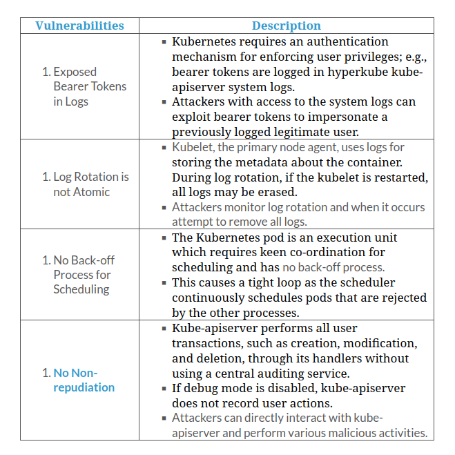
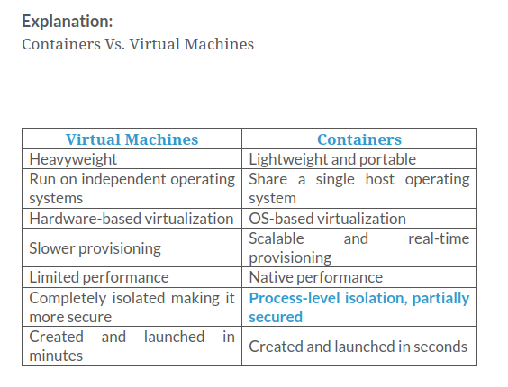

### Which of the following cloud services provides features such as single sign-on, multi-factor authentication, identity governance and administration, access management, and intelligence collection?

- SaaS
- **IDaaS**
- PaaS
- IaaS

Explanation:

    
> **Infrastructure-as-a-Service (IaaS)**: This cloud computing service enables subscribers to use on-demand fundamental IT resources, such as computing power, virtualization, data storage, and network. This service provides virtual machines and other abstracted hardware and operating systems (OSs), which may be controlled through a service application programming interface (API). As cloud service providers are responsible for managing the underlying cloud computing infrastructure, subscribers can avoid costs of human capital, hardware, and others (e.g., Amazon EC2, GoGrid, Microsoft OneDrive, Rackspace).
    
>**Platform-as-a-Service (PaaS)**: This type of cloud computing service allows for the development of applications and services. Subscribers need not buy and manage the software and infrastructure underneath it but have authority over deployed applications and perhaps application hosting environment configurations. This offers development tools, configuration management, and deployment platforms on-demand, which can be used by subscribers to develop custom applications (e.g., Google App Engine, Salesforce, Microsoft Azure). Advantages of writing applications in the PaaS environment include dynamic scalability, automated backups, and other platform services, without the need to explicitly code for them.
    
>**Software-as-a-Service (SaaS)**: This cloud computing service offers application software to subscribers on-demand over the Internet. The provider charges for the service on a pay-per-use basis, by subscription, by advertising, or by sharing among multiple users (e.g., web-based office applications like Google Docs or Calendar, Salesforce CRM, and Freshbooks).
    
>**Identity-as-a-Service (IDaaS)**: This cloud computing service offers authentication services to the subscribed enterprises and is managed by a third-party vendor to provide identity and access management services. It provides services such as Single-Sign-On (SSO), Multi-Factor-Authentication (MFA), Identity Governance and Administration (IGA), access management, and intelligence collection. These services allow subscribers to access sensitive data more securely both on and off-premises (e.g., OneLogin, Centrify Identity Service, Microsoft Azure Active Directory, Okta).

### Which of the following cloud broker services improves a given function by a specific capability and provides value-added services to cloud consumers?

- Distributed storage
- Service aggregation
- Service arbitrage
- **Service intermediation**

Explanation:

    
>**Service Intermediation**: Improves a given function by a specific capability and provides value-added services to cloud consumers.
    
>**Service Aggregation**: Combines and integrates multiple services into one or more new services.
    
>**Service Arbitrage**: It is like service aggregation but without the fixing of the aggregated services (the cloud broker can choose services from multiple agencies).
    
>**Distributed Storage**: Distributed storage is a characteristic of cloud computing that offers better scalability, availability, and reliability of data. However, cloud distributed storage can potentially raise security and compliance concerns.

### Identify the cloud computing service that protects users and organizations from both internal and external threats by filtering network traffic and includes the ability to detect malware attacks, in addition to security functionalities such as packet filtering, network analyzing, and IPsec.

- IDaaS
- CaaS
- FaaS
- **FWaaS**

Explanation:

    
>**Identity-as-a-Service (IDaaS)**: This cloud computing service offers authentication services to the subscribed enterprises and is managed by a third-party vendor to provide identity and access management services. It provides services such as Single-Sign-On (SSO), Multi-Factor-Authentication (MFA), Identity Governance and Administration (IGA), access management, and intelligence collection. These services allow subscribers to access sensitive data more securely both on and off-premises (e.g., OneLogin, Centrify Identity Service, Microsoft Azure Active Directory, Okta).
    
>**Firewalls-as-a-Service (FWaaS)**: This cloud computing service protects users and organizations from both internal and external threats by filtering the network traffic. FWaaS includes enhanced data analysis capabilities, including the ability to detect malware attacks, in addition to security functionality such as packet filtering, network analyzing, and IPsec (e.g., Zscaler Cloud Firewall, SecurityHQ, Secucloud, Fortinet, Cisco, and Sophos).
    
>**Container-as-a-Service (CaaS)**: This cloud computing model provides containers and clusters as a service to its subscribers. It provides services such as virtualization of container engines, management of containers, applications, and clusters through a web portal, or an API. Using these services, subscribers can develop rich scalable containerized applications through the cloud or on-site data centers. CaaS inherits features of both IaaS and PaaS (e.g., Amazon EC2, Google Kubernetes Engine (GKE)).
    
>**Function-as-a-Service (FaaS)**: This cloud computing service provides a platform for developing, running, and managing application functionalities without the complexity of building and maintaining necessary infrastructure (serverless architecture). This model is mostly used while developing applications for microservices. It provides on-demand functionality to the subscribers that powers off the supporting infrastructure and incurs no charges when not in use. It provides data processing services, such as Internet of Things (IoT) services for connected devices, mobile and web applications, and batch-and-stream processing (e.g., AWS Lambda, Google Cloud Functions, Microsoft Azure Functions, Oracle Functions).

### Which of the following cloud computing models allows manufacturers to sell or lease equipment to clients and receive a percentage of profits generated by that equipment?

- FWaaS
- **MaaS**
- PaaS
- SECaaS

Explanation:

    
>**Machines-as-a-Service (MaaS) Business Model**: This type of cloud computing model, also known as Equipment-as-a-Service (EaaS), allows manufacturers to sell or lease machines to clients and receive a percentage of profits generated by those machines. This model is extensively utilized and implemented to benefit both manufactures as well as clients. It is a sophisticated cloud model that allows the client and manufacturer to generate and track real-time products from the machine.

    
>**Firewalls-as-a-Service (FWaaS)**: This cloud computing service protects users and organizations from both internal and external threats by filtering the network traffic. FWaaS includes enhanced data analysis capabilities, including the ability to detect malware attacks, in addition to security functionality such as packet filtering, network analyzing, and IPsec (e.g., Zscaler Cloud Firewall, SecurityHQ, Secucloud, Fortinet, Cisco, and Sophos).
    
>**Platform-as-a-Service (PaaS)**: This type of cloud computing service allows for the development of applications and services. Subscribers need not buy and manage the software and infrastructure underneath it but have authority over deployed applications and perhaps application hosting environment configurations. This offers development tools, configuration management, and deployment platforms on-demand, which can be used by subscribers to develop custom applications (e.g., Google App Engine, Salesforce, Microsoft Azure).
    
>**Security-as-a-Service (SECaaS)**: This cloud computing model integrates security services into corporate infrastructure in a cost-effective way. It is developed based on SaaS and does not require any physical hardware or equipment. Therefore, it drastically reduces the cost compared to that spent when organizations establish their own security capabilities. It provides services such as penetration testing, authentication, intrusion detection, anti-malware, security incident and event management (e.g., eSentire MDR, Switchfast Technologies, OneNeck IT Solutions, Foundstone Managed Security Services).

### Which of the following cloud deployment models is a highly flexible model that holds several types of cloud services that can be supplied to different other clouds to help users choose a specific feature required from each cloud?

- Distributed cloud
- Public cloud
- Private cloud
- **Poly cloud**

Explanation:

    
>**Public Cloud**: In this model, the provider makes services such as applications, servers, and data storage available to the public over the Internet. Therefore, he is liable for the creation and constant maintenance of the public cloud and its IT resources. Public cloud services may be free or based on a pay-per-usage model (e.g., Amazon Elastic Compute Cloud (EC2), Google App Engine, Windows Azure Services Platform, IBM Bluemix).
    
>**Private Cloud**: A private cloud, also known as the internal or corporate cloud, is a cloud infrastructure operated by a single organization and implemented within a corporate firewall. Organizations deploy private cloud infrastructures to retain full control over corporate data (e.g., BMC Software, VMware vRealize Suite, SAP Cloud Platform).

    
>**Distributed Cloud**: It is a centralized cloud environment comprised of geographically distributed public or private clouds controlled on a single control plane for providing services to the end users located on or off site. In this model, the end user can access data anywhere as a local data center providing edge computing capability for improving data privacy and meeting local governance policies.
    
>**Poly Cloud**: This type of cloud technology holds several types of cloud services, which can be supplied to different other clouds. Unlike a multi cloud, it provides features of various clouds on a single platform to provide users with features from different cloud services based on their requirement. This model also helps users choose a specific feature required from each cloud to perform different tasks in their business environment. It provides specialized automation applications such as AI and ML services (e.g., Google Cloud Platform (GCP) and Amazon Web Services (AWS)).

### Which of the following is a docker remote driver that is a network plugin used to build a virtual network for connecting docker containers spread across multiple clouds?

- **Weave**
- Kuryr
- MACVLAN
- Contiv

Explanation:

    
>**Contiv**: Contiv is an open-source network plugin introduced by Cisco for building security and infrastructure policies for multi-tenant microservices deployments.
    
>**Weave**: Weave is a network plugin that is used to build a virtual network for connecting Docker containers spread across multiple clouds.
    
>**Kuryr**: Kuryr is a network plugin that implements the Docker libnetwork remote driver by using Neutron, an OpenStack networking service, and also includes an IPAM driver.
    
>**MACVLAN**: A macvlan driver is used to create a network connection between container interfaces and the parent host interface or sub-interfaces using the Linux MACVLAN bridge mode. It is a native network driver of a Docker engine.

### Which of the following components of the docker engine allows the communication and assignment of tasks to the daemon?

- **Rest API**
- Docker swarm
- Client CLI
- Server

Explanation:

    
>**Client CLI**: It is the command-line interface used to communicate with the daemon and where various Docker commands are initiated.
    
>**Rest API**: This API allows the communication and assignment of tasks to the daemon.
    
>**Server**: It is a persistent back-end process, also known as a daemon process (dockerd command).
    
>**Docker Swarm**: The Docker engine supports the swarm mode that allows managing multiple Docker engines within the Docker platform. Docker CLI is used for creating a swarm, deploying an application to the swarm, and handling its activity or behavior

### Which of the following is the docker native network driver that implements its own networking stack and is isolated completely from the host networking stack?

- Overlay
- Host
- **None**
- MACVLAN

Explanation:

    
> **Host**: By using a host driver, a container implements the host networking stack.
    
>**Overlay**: An overlay driver is used to enable container communication over the physical network infrastructure.
    
>**MACVLAN**: A macvlan driver is used to create a network connection between container interfaces and the parent host interface or sub-interfaces using the Linux MACVLAN bridge mode.
    
>**None**: A none driver implements its own networking stack and is isolated completely from the host networking stack.

### Which of the following constructs of the container network model comprises the container network stack configuration for the management of container interfaces, routing tables, and DNS settings?

- Endpoint
- Network
- **Sandbox**
- Bridge

Explanation:

    
>**Endpoint**: To maintain application portability, an endpoint is connected to a network and is abstracted away from the application, so that services can implement different network drivers.
    
>**Network**: A network is an interconnected collection of endpoints. Endpoints that do not have network connection cannot communicate over the network.
    
>**Sandbox**: Sandbox comprises the container network stack configuration for the management of container interfaces, routing tables, and domain name system (DNS) settings.
    
>**Bridge**: It is a component of docker native network drivers. A bridge driver is used to create a Linux bridge on the host that is managed by the Docker.

### Which of the following components of the container network model is connected to a network and is abstracted away from an application so that services can implement different network drivers?

- Network
- Bridge
- **Endpoint**
- Sandbox

Explanation:

    
>**Endpoint**: To maintain application portability, an endpoint is connected to a network and is abstracted away from the application, so that services can implement different network drivers.
    
>**Network**: A network is an interconnected collection of endpoints. Endpoints that do not have network connection cannot communicate over the network.
    
>**Sandbox**: Sandbox comprises the container network stack configuration for the management of container interfaces, routing tables, and domain name system (DNS) settings.
    
>**Bridge**: It is a component of docker native network drivers. A bridge driver is used to create a Linux bridge on the host that is managed by the Docker.

### Through which of the following Kubernetes vulnerabilities can an attacker exploit the kube-apiserver with the disabled debug mode to directly interact with it and perform various malicious activities?

- No back-off process for scheduling
- **No non-repudiation**
- Exposed bearer tokens in logs
- Log rotation is not atomic

### In which of the following attacks does an attacker abuse cloud file synchronization services, such as Google Drive and DropBox, for data compromise, command and control, data exfiltration, and remote access?

- Cloudborne attack
- Cloud hopper attack
- Cloud cryptojacking
- **Man-in-the-cloud attack**

Explanation:

    
>**Man-in-the-Cloud (MITC) Attack**: MITC attacks are carried out by abusing cloud file synchronization services, such as Google Drive or DropBox, for data compromise, command and control (C&C), data exfiltration, and remote access. Synchronization tokens are used for application authentication in the cloud but cannot distinguish malicious traffic from normal traffic. Attackers abuse this weakness in cloud accounts to perform MITC attacks.
    
>**Cloud Hopper Attack**: Cloud hopper attacks are triggered at managed service providers (MSPs) and their customers. Once the attack is successfully implemented, attackers can gain remote access to the intellectual property and critical information of the target MSP and its global users/customers. Attackers also move laterally in the network from one system to another in the cloud environment to gain further access to sensitive data pertaining to the industrial entities, such as manufacturing, government bodies, healthcare, and finance.
    
>**Cloud Cryptojacking**: Cryptojacking is the unauthorized use of the victim’s computer to stealthily mine digital currency. Cryptojacking attacks are highly lucrative, involving both external attackers and internal rogue insiders. To perform this attack, attackers leverage attack vectors like cloud misconfigurations, compromised websites, and client or server-side vulnerabilities
    
>**Cloudborne Attack**: Cloudborne is a vulnerability residing in a bare-metal cloud server that enables attackers to implant malicious backdoor in its firmware. The installed backdoor can persist even if the server is reallocated to new clients or businesses that use it as an IaaS. Physical servers are not confined to one client and can be moved from one client to another.

### Which of the following types of DNS attack involves registering an elapsed domain name?

- DNS poisoning
- **Domain snipping**
- Cybersquatting
- Domain hijacking

Explanation:

    
>**Domain Hijacking**: Involves stealing a CSP domain name.
    
>**Cybersquatting**: Involves conducting phishing scams by registering a domain name that is similar to a CSP.
    
>**DNS Poisoning**: Involves diverting users to a spoofed website by poisoning the DNS server or the DNS cache on the user’s system.
    
>**Domain Snipping**: Involves registering an elapsed domain name.

### A privilege escalation threat is caused due to which of the following weaknesses?

- Due to flaws while provisioning or de-provisioning networks or vulnerabilities in communication encryption.
- Weak authentication and authorization controls could lead to illegal access thereby compromising confidential and critical data stored in the cloud.
- Due to isolation failure, cloud customers can gain illegal access to the data.
- **A mistake in the access allocation system causes a customer, third party, or employee to get more access rights than needed.**

Explanation:

    
>**Privilege escalation**: A mistake in the access allocation system such as coding errors, design flaws, and others can result in a customer, third party, or employee obtaining more access rights than required. This threat arises because of AAA (authentication, authorization, and accountability) vulnerabilities, user-provisioning and de-provisioning vulnerabilities, hypervisor vulnerabilities, unclear roles and responsibilities, misconfiguration, and others.
    
Other given weaknesses causes following threats:

    
>**Illegal Access to the Cloud**: Weak authentication and authorization controls could lead to illegal access thereby compromising confidential and critical data stored in the cloud.
    
>**Isolation Failure**: Due to isolation failure, cloud customers can gain illegal access to the data.
    
>**Modifying Network Traffic**: Due to flaws while provisioning or de-provisioning network or vulnerabilities in communication encryption.

### Which of the following Nimbostratus commands is used by an attacker to dump all the permissions for provided credentials?

- $ nimbostratus dump-ec2-metadata
- **$ nimbostratus dump-permissions --access-key=... --secret-key=...**
- $ nimbostratus dump-credentials
- $ nimbostratus create-iam-user --access-key=... --secret-key=...

Explanation:

    
>**Dump credentials**: Extracts the credentials available with this host and prints them out to the console.
`$ nimbostratus dump-credentials`
    
>**Dump permissions**: Dumps all the permissions for the provided credentials.
`$ nimbostratus dump-permissions --access-key=... --secret-key=...`
    
>**Dump instance metadata**: Retrieves important information metadata of EC2 instances.`$ nimbostratus dump-ec2-metadata`
    
>**Create new user**: Create a new IAM user using existing credentials: `$ nimbostratus create-iam-user --access-key=... --secret-key=...`

### In which of the following techniques does an attacker use lambda functions such as rabbit_lambda, cli_lambda, and backdoor_created_users_lambda to install a backdoor to AWS infrastructure?

- **Manipulating access keys**
- Manipulating user data
- Encrypting the cloud trials using a new key
- Creating new EC2 instances

Explanation:

> Attackers install backdoors to the AWS infrastructure using the following techniques: 
>- Manipulating user data associated with an EC2 instance with privileged access rights
>- Creating new EC2 instances depending on the Amazon Machine Images (AMI) by assigning a privileged role
>- Inserting a backdoor to the existing Lambda function
>- Manipulating access keys using Lambda functions such as rabbit_lambda, cli_lambda, and backdoor_created_users_lambda

> Techniques used by attackers to cover the tracks include the following:
>- Encrypting the cloud trials using a new key    
>- Moving the trails to a new S3 bucket    
>- Using the AWS Lambda function to delete new trail entries

### Which of the following tools allows an attacker to perform account enumeration on an Azure Active Directory (AD) environment and assess the overall security of the target Azure environment?

- **Azucar**
- Hetty
- bettercap
- OWASP ZAP

Explanation:

    
>**Hetty**: Hetty is an HTTP toolkit for security research. It provides the following 
>- Machine-in-the-middle (MITM) HTTP proxy with logs and advanced 
>- HTTP client for manually creating/editing requests and replaying proxied 
>- Intercepting requests and responses for a manual review (edit, send/receive, and cancel)
    
>**Azucar**: The Azucar tool allows users to assess the overall security of an Azure environment. It is a multi-threaded plug-in-based security tool that can be used in Windows. Moreover, the script used in the tool does not affect the assets that are implemented in the Azure subscription.
    
>**bettercap**: bettercap is a portable framework written in Go that allows security researchers, red teamers, and reverse engineers to perform reconnaissance and various attacks on Wi-Fi networks, Bluetooth low energy devices, wireless HID devices, and IPv4/IPv6 networks.
    
>**OWASP ZAP**: Zed Attack Proxy (ZAP) is an integrated penetration testing tool for finding vulnerabilities in web applications. It offers automated scanners as well as a set of tools that allow users to find security vulnerabilities manually.

### Which of the following tools contains two main scanning modules, AWStealth and AzureStealth, which attackers can use to discover users, groups, and roles that have the most sensitive and risky permissions?

- Fiddler
- **SkyArk**
- CxSAST
- DroidSheep

Explanation:

    
>**DroidSheep**: The DroidSheep tool is used for session hijacking on Android devices connected to a common wireless network.
    
>**CxSAST**: Checkmarx CxSAST is a unique source-code analysis solution that provides tools for identifying, tracking, and repairing technical and logical flaws in source code, such as security vulnerabilities, compliance issues, and business logic problems.
    
>**SkyArk**: SkyArk contains two main scanning modules, AWStealth and AzureStealth. With the scanning results from SkyArk, attackers can discover the entities (users, groups, and roles) that have the most sensitive and risky permissions.
    
>**Fiddler**: Fiddler is used for performing web-application security tests such as the decryption of HTTPS traffic and manipulation of requests using an MITM decryption technique. Fiddler is a web debugging proxy that logs all HTTP(S) traffic between a computer and the Internet.

### Which of the following best practices allows security professionals to secure the docker environment?

- Disable the read-only mode on file systems and volumes
- **Always run docker images with --security-opt=no-new-privileges**
- Always expose the docker daemon socket
- Never use tools such as InSpec and DevSec to detect docker vulnerabilities

Explanation:

> Discussed below are various best practices for securing Docker environment.
> - Enable read-only mode on filesystems and volumes by setting the --read-onlyflag.
> - Limit resources such as memory, CPU, the maximum number of file descriptors, the maximum number of processes, and restarts to prevent DoS attacks.
> - Avoid exposing the Docker daemon socket because it is the basic entry point for the Docker API.
> - Always run Docker images with --security-opt=no-new-privileges to prevent privilege escalation attacks using setuid or setgid binaries.
> - Only use trusted Docker images because Docker images created by malicious users may be injected with backdoors.
> - Regularly patch host OS and Docker with the latest security updates.
> - Use tools such as InSpec and DevSec to detect Docker vulnerabilities.

### The components such as NIDS/NIPS, firewalls, DPI, Anti-DDoS, QoS, DNSSEC, and OAuth are included in which of the following cloud security control layers?

- Management layer
- **Network layer**
- Applications layer
- Computer and storage

Explanation:

> Cloud Security Control Layers

    
> **Application Layer**:
To harden the application layer, establish the policies that match with industry adoption security standards, for example, OWASP for a web application. It should meet and comply with appropriate regulatory and business requirements. Some of the application layer controls include SDLC, binary analysis, scanners, web app firewalls, transactional sec, etc.
    
>**Management Layer**:
This layer covers the cloud security administrative tasks, which can facilitate continued, uninterrupted, and effective services of the cloud. Cloud consumers should look for the above-mentioned policies to avail better services. Some of the management layer security controls include GRC, IAM, VA/VM, patch management, configuration management, monitoring, etc.
    
>**Network Layer**:
It deals with various measures and policies adopted by a network administrator to monitor and prevent illegal access, misuse, modification, or denial of network-accessible resources. Some of the additional network layer security controls include NIDS/NIPS, firewalls, DPI, anti-DDoS, QoS, DNSSEC, OAuth, etc.
    
>**Computation and Storage**:
In cloud due to the lack of physical control of the data and the machine, the service provider may be unable to manage the data and computation and lose the trust of the cloud consumers. Cloud provider must establish policies and procedures for data storage and retention. Cloud provider should implement appropriate backup mechanisms to ensure availability and continuity of services that meet with statutory, regulatory, contractual, or business requirements and compliance. Host-based firewalls, HIDS/HIPS, integrity and file/log management, encryption, masking are some security controls in computation and storage.

### Which of the following is NOT a best practice for cloud security?

- **Provide unauthorized server access using security checkpoints**
- Verify one’s cloud in public domain blacklists
- Undergo AICPA SAS 70 Type II audits
- Disclose applicable logs and data to customers

Explanation:

> Some of the Best Practices for Securing Cloud
>- Enforce data protection, backup, and retention mechanisms
>- Enforce SLAs for patching and vulnerability remediation
>- Vendors should regularly undergo AICPA SAS 70 Type II audits
>- Verify one’s cloud in public domain blacklists
>- Enforce legal contracts in employee behavior policy
>- Prohibit user credentials sharing among users, applications, and services
>- Implement secure authentication, authorization, and auditing mechanisms
>- Check for data protection at both design and runtime
>- Implement strong key generation, storage and management, and destruction practices
>- Monitor the client’s traffic for any malicious activities
>- Prevent unauthorized server access using security checkpoints
>- Disclose applicable logs and data to customers
>- Analyze cloud provider security policies and SLAs
>- Assess security of cloud APIs and also log customer network traffic
>- Providing unauthorized server access using security checkpoints is not a good practice however Preventing unauthorized server access using security checkpoints is a good practice for cloud security.

### Which of the following is a secure and independent private cloud environment that resides within the public cloud and allows clients to execute programs, host applications, save data, and perform any action on a private network using their accounts?

- Container
- Kubernetes
- SAML
- **VPC**

Explanation:

    
>**Virtual private cloud (VPC)**: VPC is a secure and independent private cloud environment that resides within the public cloud. VPC clients can execute programs, host applications, save data, and perform anything they wish on a private network using their individual accounts, but the private cloud is hosted by the public cloud provider. A VPC is generally independent from other VPCs running with the same account; hence, one VPC client cannot view the traffic directed to another client’s VPCs..
    
>**Security Assertion Markup Language (SAML)**: SAML is a popular open-standard protocol used for authentication and authorization between two communicating entities. It provides a single sign-on (SSO) facility for users to interact with multiple applications or services with one set of common credentials.
    
>**Container**: A container is a package of an application/software including all its dependencies, such as library and configuration files, binaries, and other resources that run independently from other processes in the cloud environment.
    
>**Kubernetes**: Kubernetes, also known as K8s, is an open-source, portable, extensible, orchestration platform developed by Google for managing containerized applications and microservices.

### Which of the following is an app discovery tool that provides full visibility and risk information to manage cloud applications in a secure and organized manner?

- Stream Armor
- **Cisco Umbrella**
- OllyDbg
- BeRoot

Explanation:

    
>**Cisco Umbrella**: Cisco Umbrella is an app discovery tool provides full visibility and risk information to manage cloud applications in a secure and organized manner. The dashboard displays the risk level of shadow cloud services and provides a summary based on app categories, which are sorted by their risk levels.
    
>**OllyDbg**: OllyDbg is a 32-bit assembler-level analyzing debugger for Microsoft® Windows®. Its emphasis on binary code analysis makes it particularly useful when the source is unavailable.
    
>**BeRoot**: BeRoot is a post-exploitation tool to check common misconfigurations to find a way to escalate privilege.
    
>**Stream Armor**: Stream Armor is a tool used to discover hidden ADSs and clean them completely from your system. Its advanced auto analysis, coupled with an online threat verification mechanism, helps you eradicate any ADSs that may be present.

### Which of the following tiers in the container technology architecture operates and manages containers as instructed by the orchestrator?

- **Tier 5: Hosts**
- Tier 2: Testing and accreditation systems
- Tier 1: Developer machines
- Tier 3: Registries

Explanation:

    
>Tier-1: Developer machines - image creation, testing and accreditation

>Tier-2: Testing and accreditation systems - verification and validation of image contents, signing images and sending them to the registries

>Tier-3: Registries - storing images and disseminating images to the orchestrators based on requests

>Tier-4: Orchestrators - transforming images into containers and deploying containers to hosts

>Tier-5: Hosts - operating and managing containers as instructed by the orchestrator

### Which of the following node components of the Kubernetes cluster architecture is an important service agent that runs on each node and ensures that containers run in a pod?

- Container runtime
- Etcd cluster
- Kube-proxy
- **Kubelet**

Explanation:

    
> **Kube-proxy**: It is a network proxy service that also runs on every worker node. This service maintains the network rules that enable network connection to the pods.

> **Etcd cluster**: It is a distributed and consistent key-value storage where Kubernetes cluster data, service discovery details, API objects, etc. are stored. It is a master node component.

> **Container Runtime**: Container runtime is a software designed to run the containers. Kurbernetes supports various container runtimes, such as Docker, rktlet, containerd, and cri-o.

> **Kubelet**: Kubelet is an important service agent that runs on each node and ensures containers running in a pod. It also ensures pods and containers are healthy and running as expected. Kubelet does not handle containers that are not generated by Kubernetes.

### Which of the following is the property of container technology that makes it less secure than virtual machines?

- Complete isolation
- Created and launched in minutes
- **Process-level isolation**
- Heavyweight

### Which of the following attacks involves the manipulation of the CND server to store an error page instead of the genuine one to trick users and prevent them from accessing cloud resources?

- **CPDoS attack**
- Brute-force attack
- Zero-day DDoS attack
- Mask attack

Explanation:

    
> **Brute-Force Attack**: In a brute-force attack, attackers try every combination of characters until the password is broken.

> **Mask Attack**: Mask attack is similar to brute-force attacks but recovers passwords from hashes with a more specific set of characters based on information known to the attacker. Brute-force attacks are time-consuming because the attacker tries all possible combinations of characters to crack the password. In contrast, in a mask attack, the attacker uses a pattern of the password to narrow down the list of possible passwords and reduce the cracking time.

> **Cache Poisoned Denial of Service (CPDoS)/Content Delivery Network (CDN) Cache Poisoning Attack**: In a CPDoS or CDN cache poisoning attack, attackers create malformed or oversized HTTP requests to trick the origin web server into responding with malicious or error content, which can be cached at the content delivery network (CDN) servers. Therefore, the malicious or error-based content is cached in the CDN server, which delivers it to legitimate users, resulting in a DoS attack on the target network.

> **Zero-Day DDoS Attack**: Zero-day DDoS attacks are attacks in which DDoS vulnerabilities do not have patches or effective defensive mechanisms. Until the victim identifies the threat actor’s attack strategy and deploys a patch for the exploited DDoS vulnerability, the attacker actively blocks all the victim’s resources and steals the victim’s data.

### Which of the following is cloud malware designed to exploit misconfigured kubelets in a Kubernetes cluster for infecting all the containers in the Kubernetes environment?

- njRAT
- Dreambot
- **Hildegard**
- Necurs

Explanation:

    
> **§njRAT**: njRAT is a RAT with powerful data-stealing capabilities. In addition to logging keystrokes, it can access a victim's camera, stealing credentials stored in browsers, uploading and downloading files, performing process and file manipulations, and viewing the victim's desktop.

> **Necurs**: The Necurs botnet is a distributor of many pieces of malware, most notably Dridex and Locky. It delivers some of the worst banking Trojans and ransomware threats in batches of millions of emails at a time, and it keeps reinventing itself.

> **Hildegard**: Hildegard is cloud malware designed to exploit misconfigured kubelets in a Kubernetes cluster and infect all the containers present in the Kubernetes environment. Hildegard helps attackers in bypassing security solutions and altering system configurations to hide their presence.

> **Dreambot**: Dreambot banking Trojans are also known as updated versions of Ursnif or Gozi. Dreambot Trojans have long been used by hackers, and they have been regularly updated with more sophisticated capabilities.

### Which of the following measures is NOT a best practice for securing a Kubernetes environment?

- Use offensive security certified professional stapling
- Use the copy-then-rename method for log rotation
- Use kube-apiserver instances that maintain CRLs
- **Use a separate encoding format for each configuration task**

Explanation:

> Discussed below are various best practices for securing the Kubernetes environment.

> - Use the copy-then-rename method for log rotation to ensure that logs are not lost when restarting the kubelet.
> - Use kube-apiserver instances that maintain CRLs to check the presented certificates.
> - Use offensive security certified professional stapling to check the revocation status of certificates.
> - Use single encoding format for all configuration tasks because it supports centralized validation.
> - Ensure proper validation of file contents and their path at every stage of processing.
> - Avoid using legacy SSH tunnels because they do not perform proper validation of server IP addresses.
> - Use secure TLS by default in development and production configurations to reduce vulnerabilities owing to misconfiguration.

### Which of the following categories of security controls minimizes the consequences of an incident by limiting the damage?

- Deterrent controls
- **Corrective controls**
- Preventive controls
- Detective controls

Explanation:

> **Deterrent Controls**: These controls reduce attacks on the cloud system. Example: Warning sign on the fence or property to inform adverse consequences for potential attackers if they proceed to attack
> **Preventive Controls**: These controls strengthen the system against incidents, probably by minimizing or eliminating vulnerabilities. Example: Strong authentication mechanism to prevent unauthorized use of cloud systems.
> **Detective Controls**: These controls detect and react appropriately to the incidents that happen. Example: Employing IDSs, IPSs, etc. helps to detect attacks on cloud systems.
> **Corrective controls**: These controls minimize the consequences of an incident, probably by limiting the damage. Example: Restoring system backups.

### Which of the following entities of cloud network security establishes a private connection between a VPC and another cloud service without access to the Internet, external gateways, NAT solutions, VPN connections, or public addresses?

- Gateway-load-balancer endpoint
- Transit gateway
- Public subnet
- **VPC endpoint**

Explanation:

> **Gateway-load-balancer endpoint**: It is also an ENI and operates as an initial point of source to impede traffic flow and divert it to a service that has been configured through a gateway load balancer, which is then used for security inspection.
    
> **Public and private subnets**: The subnets in VPC can be public or private. The virtual machines residing in the public subnet can transmit data packets directly over the web, while the VMs in a private subnet cannot.
    
> **Transit gateways**: A transit gateway is a network routing solution that establishes and manages communication between an on-premises consumer network and VPCs via a centralized unit. This approach simplifies the network topology and eliminates complicated peering connections.
    
> **VPC endpoint**: A VPC endpoint establishes a private connection between a VPC and another cloud service without access to the Internet, external gateways, NAT solutions, VPN connections, or public addresses. Therefore, the traffic between endpoints does not leave the organization’s network.

