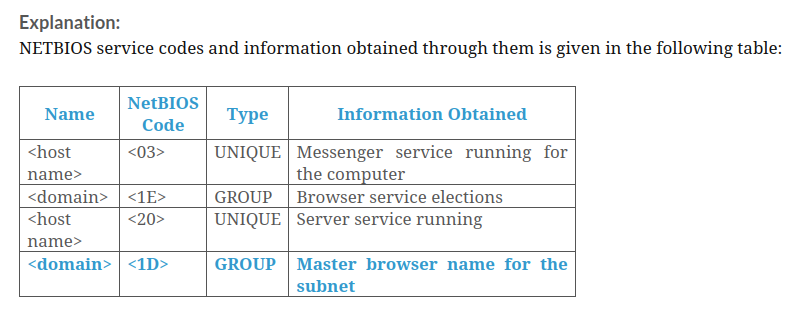

### An attacker is using the scanning tool Hping to scan and identify live hosts, open ports, and services running on a target network. He/she wants to collect all the TCP sequence numbers generated by the target host. Which of the following Hping commands he/she needs to use to gather the required information?
- hping3 –A <Target IP> –p 80
- hping3 -S <Target IP> -p 80 --tcp-timestamp
- **hping3 <Target IP> -Q -p 139 -s**
- hping3 –F –P –U 10.0.0.25 –p 80

Explanation:
    
>**hping3 <Target IP> -Q -p 139 -s**: By using the argument -Q in the command line, Hping collects all the TCP sequence numbers generated by the target host.

>**hping3 –A <Target IP> –p 80**: By issuing this command, Hping checks if a host is alive on a network. If it finds a live host and an open port, it returns an RST response.

>**hping3 -S <Target IP> -p 80 --tcp-timestamp**: By adding the --tcp-timestamp argument in the command line, Hping enable TCP timestamp option and try to guess the timestamp update frequency and uptime of the target host.

>**hping3 –F –P –U 10.0.0.25 –p 80**: By issuing this command, an attacker can perform FIN, PUSH, and URG scans on port 80 on the target host.

### If a tester is attempting to ping a target that exists but receives no response or a response that states the destination is unreachable, ICMP may be disabled and the network may be using TCP. Which other option could the tester use to get a response from a host using TCP?
- Broadcast ping
- Traceroute
- **Hping**
- TCP ping

Explanation:
>**Hping2/Hping3** is a command-line-oriented network scanning and packet crafting tool for the TCP/IP protocol that sends ICMP echo requests and supports TCP, UDP, ICMP, and raw-IP protocols. It performs network security auditing, firewall testing, manual path MTU discovery, advanced traceroute, remote OS fingerprinting, remote uptime guessing, TCP/IP stacks auditing, and other functions.

>In the above scenario, host does not respond to a ping request. Here, tester need to use Hping tools and perform ACK scan to get the response from a host using TCP. 

>Hping can be configured to perform an ACK scan by specifying the argument -A in the command line. Here, you are setting ACK flag in the probe packets and performing the scan. You perform this scan when a host does not respond to a ping request. By issuing this command, Hping checks if a host is alive on a network. If it finds a live host and an open port, it returns an RST response.

### Which of the following Hping3 command is used to perform ACK scan?
- hping3 -2 <IP Address> –p 80
- hping3 -8 50-60 –S <IP Address> –V
- hping3 -1 <IP Address> –p 80
- **hping3 –A <IP Address> –p 80**

Explanation:
>- hping3 -1 <IP Address> –p 80 : ICMP ping
>- hping3 –A <IP Address> –p 80 : ACK scan on port 80
>- hping3 -2 <IP Address> –p 80 : UDP scan on port 80
>- hping3 -8 50-60 –S <IP Address> –V : SYN scan on port 50-60

### Which of the following ping methods is effective in identifying active hosts similar to the ICMP timestamp ping, specifically when the administrator blocks the conventional ICMP ECHO ping?
- ICMP ECHO ping sweep
- ICMP ECHO ping scan
- UDP ping scan
- **ICMP address mask ping scan**

Explanation:
>**ICMP Address Mask Ping Scan**: This type of ping method is also effective in identifying the active hosts similarly to the ICMP timestamp ping, specifically when the administrator blocks the traditional ICMP Echo ping

>**ICMP ECHO Ping Scan**: ICMP ECHO ping scan involves sending ICMP ECHO requests to a host. If the host is alive, it will return an ICMP ECHO reply. This scan is useful for locating active devices or determining if ICMP is passing through a firewall.

>**ICMP ECHO Ping Sweep**: A ping sweep (also known as an ICMP sweep) is a basic network scanning technique that is adopted to determine the range of IP addresses that map to live hosts (computers). Although a single ping will tell the user whether a specified host computer exists on the network, a ping sweep consists of ICMP ECHO requests sent to multiple hosts. If a specified host is active, it will return an ICMP ECHO reply.

>**UDP Ping scan**: UDP ping scan is similar to TCP ping scan; however, in the UDP ping scan, Nmap sends UDP packets to the target host.

### While performing a UDP scan of a subnet, you receive an ICMP reply of Code 3/Type 3 for all the pings you have sent out. What is the most likely cause of this?
- The host does not respond to ICMP packets.
- UDP port is open.
- **UDP port is closed.**
- The firewall is dropping the packets.

### Which NMAP command combination would let a tester scan every TCP port from a class C network that is blocking ICMP with fingerprinting and service detection?
- NMAP -P0 -A -O -p1-65535 192.168.0/24
- NMAP -PN -O -sS -p 1-1024 192.168.0/8
- NMAP -P0 -A -sT -p0-65535 192.168.0/16
- **NMAP -PN -A -O -sS 192.168.2.0/24**

Explanation:
> **-Pn** (also known as No ping) Assume the host is up, thus skipping the host discovery phase, whereas P0 (IP Protocol Ping) sends IP packets with the specified protocol number set in their IP header.

>**-A** This options makes Nmap make an effort in identifying the target OS, services, and the versions. It also does traceroute and applies NSE scripts to detect additional information.

>The **-O** option turns on Nmap’s OS fingerprinting system. Used alongside the -v verbosity options, you can gain information about the remote operating system and about its TCP sequence number generation (useful for planning idle scans).

>**-sS** Perform a TCP SYN connect scan. This just means that Nmap will send a TCP SYN packet just like

>any normal application would do. If the port is open, the application must reply with SYN/ACK; however, to prevent half-open connections Nmap will send an RST to tear down the connection again.

>**-sT** is an Nmap TCP connect scan and it is the default TCP scan type when SYN scan is not an option.

>Since, Class C network starts its IP address from 192.0.0.0.

>So, **“NMAP -PN -A -O -sS 192.168.2.0/24”** is the correct answer.

### Which of the following tools can be used to perform LDAP enumeration?
- Nsauditor network security auditor
- SoftPerfect network scanner
- **AD Explorer**
- SuperScan

Explanation:

>Among the given options, AD Explorer can be used to perform LDAP enumeration, whereas SoftPerfect network scanner, SuperScan, and Nsauditor network security auditor are tools that are used to perform NetBIOS enumeration.

### Which of the following ntpdate parameters is used by an attacker to perform a function that can force the time to always be slewed?
- **-B**
- -d
- -b
- -q

Explanation:
 
>ntpdate parameters and their respective functions
>- -B 	Force the time to always be slewed
>- -b	Force the time to be stepped
>- -d	Enable debugging mode
>- -q	Query only; do not set the clock

### Which of the following tools is used by an attacker for SMTP enumeration and to extract all the email header parameters, including confirm/urgent flags?
- Wireshark
- JXplorer 
- **NetScanTools Pro** 
- Snmpcheck

Explanation:

>**NetScanTools Pro**: NetScanTools Pro’s SMTP Email Generator tool tests the process of sending an email message through an SMTP server.

>**Wireshark**: It is packet analyzer used for network examination, protocol inspection and trouble shooting.

>**JXplorer**: It is java-based application used to search any LDAP directory.

>**Snmpcheck**: Its goal is to automate the process of gathering information on any device with SNMP support (Windows, Unix-like, network appliances, printers, etc.)

### Which of the following tools allows an attacker to scan domains and obtain a list of subdomains, records, IP addresses, and other valuable information from a target host?

- cSploit
- Experian
- X-Ray
- **Nmap**

Explanation:

>**Experian**: Experian provides insights into competitors’ search, affiliate, display, and social marketing strategies and metrics to improve marketing campaign results.

>**Nmap**: Attackers use Nmap to scan domains and obtain a list of subdomains, records, IP addresses, and other valuable information from the target host.

>**cSploit**: cSploit is an Android network analysis and penetration suite that is used to map the local network, fingerprint hosts' operating systems and open ports, perform integrated traceroute, forge TCP/UDP packets, and perform MITM attacks such as password sniffing, JavaScript injection, capturing real-time network traffic, DNS spoofing, and session hijacking.

>**X-Ray**: X-Ray allows you to scan your Android device for security vulnerabilities that put your device at risk. 

### Which of the following practices allows an attacker to perform NFS enumeration attempts on a target network?

- Ensure that users are not running suid and sgid on the exported file system.
- Use the principle of least privileges.
- Log the requests to access the system files on the NFS server.
- **Implement firewall rules to allow NFS port 2049.**

Explanation:

>NFS Enumeration Countermeasures
>- Implement firewall rules to block NFS port 2049.
>- Log the requests to access the system files on the NFS server.
>- Implement the principle of least privileges to mitigate threats such as data modification, data addition, and the modification of configuration files by normal users.
>- Ensure that users are not running suid and sgid on the exported file system.
>- Ensure that the NIS netgroup has a fully defined hostname to prevent the granting of higher access to other hosts.

### Which of the following protocols provides reliable multiprocess communication service in a multinetwork environment?

- SMTP
- SNMP
- **TCP**
- UDP

Explanation:

    
>**Transmission control protocol (TCP)** is a connection-oriented protocol. It is capable of carrying messages or e-mail over the Internet. It provides reliable multiprocess communication service in a multinetwork environment.
    
>**UDP** is a connectionless protocol, which provides unreliable service. It carries short messages over a computer network.

>**SMTP** is a TCP/IP mail delivery protocol. It transfers e-mail across the Internet and the local network. It runs on connection-oriented service provided by TCP.

>**Simple network management protocol (SNMP)** is widely used in network management systems to monitor network-attached devices such as routers, switches, firewalls, printers, servers, and so on.

### What is the default port used by IPSEC IKE protocol?

- Port 4500
- **Port 500**
- Port 50
- Port 51

Explanation:

    
>**IPSEC IKE**: IP Security Internet Key Exchange Protocol is used for establishing Security Association for IPsec Protocol Suite. IKE uses UDP port 500 for establishing security association.

>**UDP port 4500**: is used IPsec NAT-T

>**Remote Mail Checking Protocol**: uses UDP/TCP port 50

>**Port 51**: is reserved by IANA

### Which of the following NetBIOS service codes is used to obtain information related to the master browser name for the subnet?

- <20>
- <03>
- <1E>
- **<1D>**

### Which of the following SMTP in-built commands tells the actual delivery addresses of aliases and mailing lists?

- RCPT TO
- VRFY
- **EXPN**
- PSINFO

Explanation:

    
>Mail systems commonly use SMTP with POP3 and IMAP that enables users to save the messages in the server mailbox and download them occasionally from the server. SMTP uses Mail Exchange (MX) servers to direct the mail via DNS. It runs on TCP port 25.
    
>SMTP provides 3 built-in-commands:
>- VRFY - Validates users
>- EXPN - Tells the actual delivery addresses of aliases and mailing lists
>- RCPT TO - Defines the recipients of the message
    
>SMTP servers respond differently to VRFY, EXPN, and RCPT TO commands for valid and invalid users from which we can determine valid users on SMTP server. Attackers can directly interact with SMTP via the telnet prompt and collect list of valid users on the SMTP server.

### Which of the following location and data examination tools allows ethical hackers to perform two or more scans on different machines in the network?

- **Cluster scanner**
- Agent-based scanner
- Proxy scanner
- Network-based scanner

Explanation:

Listed below are some of the location and data examination tools:

>**Network-Based Scanner**: Network-based scanners are those that interact only with the real machine where they reside and give the report to the same machine after scanning.

>**Agent-Based Scanner**: Agent-based scanners reside on a single machine but can scan several machines on the same network.

>**Proxy Scanner**: Proxy scanners are the network-based scanners that can scan networks from any machine on the network.

>**Cluster scanner**: Cluster scanners are similar to proxy scanners, but they can simultaneously perform two or more scans on different machines in the network.

### Jim, an ethical hacker, was hired to perform a vulnerability assessment on an organization to check the security posture of the organization and its vulnerabilities. Jim used a tool that helped him continuously identify threats and monitor unexpected changes in the network before they turn into breaches.

Which of the following tools did Jim employ in the above scenario?

- Octoparse
- Sherlock
- theHarvester
- **Qualys VM**

Explanation:

>theHarvester: theHarvester is a tool designed to be used in the early stages of a penetration test. It is used for open-source intelligence gathering and helps to determine a company's external threat landscape on the Internet. Attackers use this tool to perform enumeration on the LinkedIn social networking site to find employees of the target company along with their job titles.

>**Qualys VM**: Qualys VM is a cloud-based service that gives immediate, global visibility into where IT systems might be vulnerable to the latest Internet threats and how to protect them. It helps to continuously identify threats and monitor unexpected changes in a network before they turn into breaches

>Sherlock: Attackers use Sherlock to search a vast number of social networking sites for a target username. This tool helps the attacker to locate the target user on various social networking sites along with the complete URL.

>Octoparse: Octoparse offers automatic data extraction, as it quickly scrapes web data without coding and turns web pages into structured data. As shown in the screenshot, attackers use Octoparse to capture information from webpages, such as text, links, image URLs, or html code.

