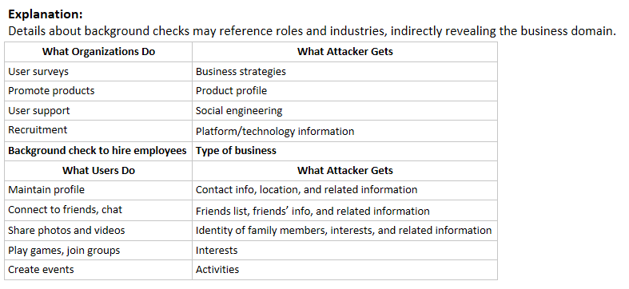

### Which of the following footprinting techniques allows an attacker to gather information passively about the target without direct interaction?
- Extracting DNS information
- **Extracting information using Internet archives**
- Performing traceroute analysis
- Performing social engineering

Explanation:

>Few of the **Passive footprinting** techniques include:
>- Finding information through search engines
>- Finding the Top-level Domains (TLDs) and sub-domains of a target through web services
>- Collecting location information on the target through web services
>- Performing people search using social networking sites and people search services
>- Gathering financial information about the target through financial services
>- Extracting information about the target using Internet archives

>Few of the **Active footprinting** techniques include:
>- Gathering information through email tracking
>- Harvesting email lists
>- Performing Whois lookup
>- Extracting DNS information
>- Performing traceroute analysis
>- Performing social engineering

### Which of the following activities on social networking sites can help an attacker deduce the type of business the organization operates?
- Create personal events
- Maintain user profile
- **Background check to hire employees**
- Connect to friends, chat

 

### Which of the following is a query and response protocol used for querying databases that store the registered users or assignees of an Internet resource, such as a domain name, an IP address block, or an autonomous system?
- Traceroute
- **Whois lookup**
- DNS lookup
- TCP/IP

Explanation:

>Whois is a query and response protocol used for querying databases that store the registered users or assignees of an Internet resource, such as a domain name, an IP address block, or an autonomous system. This protocol listens to requests on port 43 (TCP). Regional Internet Registries (RIRs) maintain Whois databases and it contains the personal information of domain owners. For each resource, Whois database provides text records with information about the resource itself, and relevant information of assignees, registrants, and administrative information (creation and expiration dates).

>Whois query returns following information:
>- Domain name details
>- Domain name servers
>- NetRange
>- When a domain has been created
>- Contact details of domain owner
>- Expiry records
>- Records last updated

>TCP/IP, or the Transmission Control Protocol/Internet Protocol, is a suite of communication protocols used to interconnect network devices on the internet. TCP/IP can also be used as a communications protocol in a private network (an intranet or an extranet).

>DNS Lookup reveals information about DNS zone data. DNS zone data include DNS domain names, computer names, IP addresses, and much more about a particular network.

>The Traceroute utility can detail the path travelled by IP packets between two systems. The utility can trace the number of routers the packets travel through, the round trip time (duration in transiting between two routers), and, if the routers have DNS entries, the names of the routers and their network affiliation. It can also trace geographic locations.

### James, a professional hacker, targeted the employees of an organization to establish footprints in their network. For this purpose, he employed an online reconnaissance tool to extract information on individuals belonging to the target organization. The tool assisted James in obtaining employee information such as phone numbers, email addresses, address history, age, date of birth, family members, and social profiles. Identify the tool employed by James in the above scenario.
- **Spokeo** 
- Photon 
- KFSensor 
- Nikto 

Explanation:
	
>**Photon**: Attackers can use tools such as Photon to retrieve archived URLs of the target website from archive.org.

>**Nikto**: Nikto is an Open Source (GPL) web server scanner that performs comprehensive tests against web servers for multiple items, including over 6700 potentially dangerous files or programs, checks for outdated versions of over 1250 servers, and checks for version specific problems on over 270 servers.

>**KFSensor**: KFSensor is a Windows-based honeypot intrusion detection system (IDS). It acts as a honeypot designed to attract and detect hackers and worms by simulating vulnerable system services and Trojans.

>**Spokeo**: Attackers can use the Spokeo people search online service to search for people belonging to the target organization. Using this service, attackers obtain information such as phone numbers, email addresses, address history, age, date of birth, family members, social profiles, and court records.