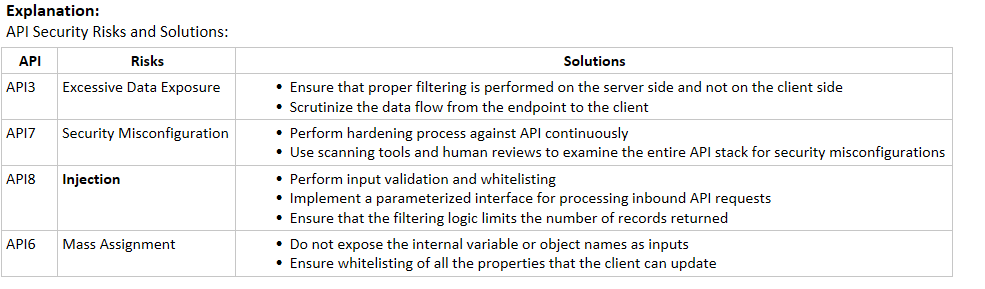

Which of the following is an operation in the web service architecture that involves obtaining the service interface description at the time of development as well as the binding and location description calls at run time?

**Find**
Bind
Publish
Service

Explanation:
    • Publish: During this operation, service descriptions are published to allow the requester to discover the services
    • During this operation, the requester calls and establishes communication with the services during run time, using binding data inside the service descriptions to locate and invoke the services.
    • Find: During this operation, the requester tries to obtain the service descriptions. This operation can be processed in two different phases: obtaining the service interface description at development time and obtain the binding and location description calls at run time.
    • Service: It is a software module offered by the service provider over the Internet. It communicates with the requesters. At times, it can also serve as a requester, invoking other services in its implementation

Which of the following is a security risk due to the incorrect implementation of applications, allowing attackers to compromise passwords, keys, session tokens, and exploit user identity?

**roken authentication**
Security misconfiguration
Injection
Sensitive data exposure

Explanation:
    • Injection: Injection flaws, such as SQL, command injection, and LDAP injection, occur when untrusted data is sent to an interpreter as part of a command or query. The attacker’s hostile data can trick the interpreter into executing unintended commands or accessing data without proper authorization.
    • Broken Authentication: Application functions related to authentication and session management are often implemented incorrectly, thereby allowing attackers to compromise passwords, keys, or session tokens or to exploit other implementation flaws to assume identities of other users (temporarily or permanently).
    • Sensitive Data Exposure: Many web applications and APIs do not properly protect sensitive data, such as financial, healthcare, and personally identifiable information (PII) data. Attackers may steal or modify such weakly protected data to conduct credit card fraud, identity theft, or other crimes. Sensitive data requires extra protection such as encryption at rest or in transit, as well as special precautions when exchanged with the browser.
    • Security Misconfiguration: Security misconfiguration is the most common issue in web security, which is due in part to manual or ad hoc configuration (or no configuration at all), insecure default configurations, open S3 buckets, misconfigured HTTP headers, error messages containing sensitive information, and not patching or upgrading systems, frameworks, dependencies, and components in a timely manner (or at all).

An attacker exploits a web application by tampering with the form and parameter of the web application and he is successful in exploiting the web application and gaining access. Which type of vulnerability did the attacker exploit?

**Security misconfiguration**
Broken access control 
SQL injection
Sensitive data exposure

Explanation:
    • Using misconfiguration vulnerabilities such as unvalidated inputs, parameter/form tampering, improper error handling, insufficient transport layer protection, and so on, attackers gain unauthorized accesses to default accounts, read unused pages, read/write unprotected files and directories, and so on. Security misconfiguration can occur at any level of an application stack, including the platform, webserver, application server, framework, and custom code.

During a penetration test, a tester finds that the web application being analyzed is vulnerable to XSS. Which of the following conditions must be met to exploit this vulnerability?

The victim's browser must have ActiveX technology enabled.
The victim user should not have an endpoint security solution.
The web application does not have the secure flag set.
**The session cookies do not have the HttpOnly flag set.**

Explanation:
    • Generally, the XSS attacks target stealing session cookies. If for a web application the HttpOnly flag is not set then it is vulnerable XSS attack. A web server can defend against such attacks by setting the HttpOnly flag on a cookie it creates which is not accessible to the client. When a browser supports HttpOnly and detects a cookie containing the HttpOnly flag, the client side script tries to access the cookie then the browser returns back an empty string. This defends XSS attack by preventing the malicious code sending data to the attacker’s website.

Which of the following conditions must be given to allow a tester to exploit a cross-site request forgery (CSRF) vulnerable web application?

The session cookies generated by the application do not have the HttpOnly flag set.
The victim user must open a malicious link with an Internet Explorer prior to version 8.
**The web application should not use random tokens.**
The victim user must open a malicious link with Firefox prior to version 3.

Explanation:
    • In a CSRF attack, an attacker exploits the trust of an authenticated user to pass malicious code or commands to the web server. In order to exploit a CSRF vulnerable web application, the web application should not use random tokens.

In which of the following attack techniques does an attacker lure victims via email or a link that is constructed such that the loopholes of remote execution code become accessible, allowing the attacker to obtain access privileges equal to those of authorized users?

Frame injection
Session fixation
Request forgery attack
**ActiveX attack**

Explanation:
    • Request Forgery Attack: In a request forgery attack, attackers exploit the trust of a website or web application on a user's browser. The attack works by including a link on a page, which takes the user to an authenticated website.
    • Frame Injection: When scripts do not validate their input, attackers inject code through frames. This affects all the browsers and scripts that do not validate untrusted input. These vulnerabilities occur in HTML pages with frames. Another reason for this vulnerability is that web browsers support frame editing.
    • Session Fixation: Session fixation helps attackers hijack valid user sessions. They authenticate themselves using a known session ID and then use the known session ID to hijack a user-validated session. Thus, attackers trick users and access a genuine web server using an existing session ID value.  
    • ActiveX Attacks: Attackers lure victims via email or via a link that is constructed such that the loopholes of remote execution code become accessible, allowing the attackers to obtain access privileges equal to those of authorized users.

Which of the following attacks allows an attacker to inject malicious content, modify the user´s online experience, and obtain unauthorized information?

**Session poisoning**
Session brute-forcing
Session prediction
Cross-site request forgery

Explanation:
    • Session prediction: It focuses on predicting session ID values that allow the attacker to bypass the authentication mechanism of an application. By analyzing and understanding the session ID generation process, the attacker can predict a valid session ID value and gain access to the application.
    • Session brute-forcing: An attacker brute-forces the session ID of a target user and uses it to log in as a legitimate user and gain access to the application.
    • Session poisoning: It allows an attacker to inject malicious content, modify the user´s online experience, and obtain unauthorized information.
    • Cross-Site Request Forgery: Cross-site request forgery (CSRF), also known as a one-click attack, occurs when a hacker instructs a user’s web browser to send a request to the vulnerable website through a malicious web page.

An attacker wants to exploit a webpage. From which of the following points does he start his attack process?

Map the attack surface 
**Identify entry points for user input**
Identify server-side technologies
Identify server-side functionality

Explanation:
    • The first step in analyzing a web app is to check for the application entry point, which can later serve as a gateway for attacks. One of the entry points includes the front-end web app that intercepts HTTP requests. Other web app entry points are user interfaces provided by webpages, service interfaces provided by web services, serviced components, and .NET remoting components. Attackers should review the generated HTTP request to identify the user input entry points.

Which of the following data can be gathered by attackers after infecting the Google Chrome browser?

**User’s spoken language**
Partners of the organization 
News articles, press releases, and related documents 
Legal documents related to the organization 

Explanation:
The following information can be gathered by attackers after infecting the Google Chrome browser.
    • User Activity 
        ○ User’s spoken language
        ○ Most recent sites visited
        ○ Types of media files accessed the most
        ○ Financial transactions through e-commerce sites
        ○ User’s trusted contact list and details saved on the browser
        ○ Geo-location
        ○ User device’s gyro and proximity sensor data while using GPS

Which of the following metadata formats does the SOAP API use to reveal a large amount of technical information such as paths, parameters, and message formats?

Swagger
**WSDL/XML-Schema**
I/O Docs
API-Blueprint

Explanation:
    • API metadata reveals a lot of technical information such as paths, parameters, and message formats that are useful in performing the attack
    • REST API uses metadata formats such as Swagger, RAML, API-Blueprint, and I/O Docs, whereas SOAP API uses WSDL/XML-Schema, etc.

Which of the following parameters defines the level of access to an application to redirect a user agent to the authorization server?

**scope**
redirect_uri
response_type
State

Explanation:
The user agent can be redirected to the authorization server by the client using the following parameters:
    • response _type: Code used for informing the server which permissions to execute
    • redirect_uri: URI where the authorization server redirects the user agent when the authorization code is provided
    • scope: Defines the level of access to the application
    • State: Opaque value used for security implementations. The value is also used for maintaining the state between request and callback

Which of the following APIs is a user-defined HTTP callback or push API that is raised based on events triggered, such as receiving a comment on a post or pushing code to the registry?

**Webhook**
SOAP API
RESTful API 
REST API

Explanation:
    • REST API: REST API vulnerabilities introduce risks that are similar to web applications, such as critical data theft and intermediate data tampering.
    • Webhooks: Webhooks are user-defined HTTP callback or push APIs that are raised based on events triggered, such as receiving a comment on a post or pushing code to the registry. Webhooks allow applications to update other applications with the latest information
    • SOAP API: SOAP is a web-based communication protocol that enables interactions between applications running on different platforms. SOAP-based APIs are programmed to generate, recover, modify and erase different logs such as profiles, credentials, and business leads.
    • RESTful API: RESTful API is a RESTful service that is designed using REST principles and HTTP communication protocols. RESTful is a collection of resources that use HTTP methods such as PUT, POST, GET, and DELETE.

Which of the following API security risks can be prevented by performing input validation, implementing a parameterized interface for processing inbound API requests, and limiting the number of records returned?

Security misconfiguration 
Mass assignment
**Injection**
Excessive data exposure 

Which of the following best practices should be followed to prevent web-shell installation?

Activate directory browsing in the web server 
Do not use escapeshellarg() or escapeshellcmd()
**Establish a reverse proxy service for retrieving resources** 
Enable all PHP functions such as exec(), shell_exec(), show_source(), proc_open(), passthru(), and pcntl_exec()

Explanation:
Following are the various best practices for preventing the installation of a web shell are discussed below:
    • Establish a demilitarized zone (DMZ) between the web server and the internal network 
    • Ensure secure configuration of the web server using strong authentication techniques and avoid using default passwords
    • Perform user input data validation to control and prevent local file inclusion and remote file inclusion (LFI and RFI) vulnerabilities
    • Establish a reverse proxy service for retrieving resources and restricting the admin URLs to known legitimate ones
    • Deploy firewalls on the web server to monitor and control the network traffic based on the security rules
    • Deactivate directory browsing in the web server to prevent directory traversal attacks 
    • Disable all unused and risky PHP functions such as exec(), shell_exec(), show_source(), proc_open(), passthru(), and pcntl_exec()
    • Use escapeshellarg() and escapeshellcmd() to ensure that the user inputs are not injected into the shell commands to avoid command execution vulnerabilities

Which of the following techniques is NOT a best practice for securing webhooks?

**Avoid validating the X-OP-Timestamp within the threshold of the current time** 
Use threaded requests to send multiple requests simultaneously
Ensure that event processing is idempotent 
Use rate limiting on webhook calls in the web server 

Explanation:
Some of the best practices for securing webhooks are as follows:
    • Use rate limiting on webhook calls in the web server to control the incoming and outgoing traffic
    • Compare the request timestamp X-Cld-Timestamp of the webhook with the current timestamp to prevent timing attacks
    • Validate the X-OP-Timestamp within the threshold of the current time 
    • Ensure that the event processing is idempotent to prevent event receipts replication
    • Ensure that the webhook code responds with 200 OK (success) instead of 4xx or 5xx statuses in case of errors to ensure that the webhooks are not deactivated
    • Ensure that the webhook URL supports the HTTP HEAD method to retrieve meta-information without transferring the entire content
    • Use threaded requests to send multiple requests at the same time and to update data in the API rapidly
    • Make sure that the tokens are stored against the store_hash and not against the user data

Which of the following is a standard protocol used to display all user information through a GET request?

Webhooks
**WebFinger**
Web API
SOAP API

Explanation:
    • Web API: Web API is an application programming interface that provides online web services to client-side applications for retrieving and updating data from multiple online sources.
    • Webhooks: Webhooks are user-defined HTTP callback or push APIs that are raised based on events triggered, such as comment received on a post and pushing code to the registry. A webhook allows an application to update other applications with the latest information.
    • WebFinger: WebFinger is a standard protocol used to display all user information through a GET request.
    • SOAP API: SOAP is a web-based communication protocol that enables interactions between applications running on different platforms such as Windows, macOS, Linux, etc., via XML and HTTP. SOAP-based APIs are programmed to generate, recover, modify, and erase different logs such as profiles, credentials, and business leads.

In which of the following layers of API security, middleware can be used by the API to provide a query plan by calling the data layer?

Layer four
Layer three
Layer one
**Layer two**

Explanation:
    • Layer Three: In this layer, an SQL join must be used to query an SQL database using the data link layer based on API calls. This helps in ensuring that all the queries match the user responsible for the API call. Moreover, this verifies the user context, in contrast to its data stored by the SQL layer.
    • Layer One: The API validates the user to check whether the entity is authorized by the company. In this situation, the developers can use API security, by which an exception will be returned if the user is not authorized or permitted.
    • Layer Two: In this layer, middleware can be used by the API to provide a query plan by calling the data layer. The database layer declares a filter for the company ID before sending a request. Developers can include a security mechanism to return an exception such as “Unsafe Data Query” in the absence of such a filter.
    • Layer Four: This layer creates a mapper layer that enables the conversion of all the database records into different user-visible models. This technique can be used to prevent sensitive data such as implementation details from the public or customers.

Which of the following practices can help security experts in securing webhooks from malicious attacks?

**Do not send confidential information using webhooks; instead, use authorized APIs**
Use the same event ID to record every webhook payload within the database
Validate the X-OP-Timestamp above a threshold from the current time
Ensure that the event processing is non-idempotent toward event receipts

Explanation:
Various best practices for securing webhooks are as follows:
    • Validate the X-OP-Timestamp within a threshold from the current time.
    • Ensure that the event processing is idempotent to prevent the replication of event receipts.
    • Do not send confidential information using webhooks; instead, use authorized APIs. 
    • Use HMAC-based signatures to perform message verification and avoid payload exploitation. 
    • Use a unique event ID to record every webhook payload within the database. 
    • Log each of the sent webhooks for debugging when required.

Which of the following countermeasures should be followed to protect web applications against broken authentication and session management attacks?

Never use SSL for all authenticated parts of the application
Submit session data as part of GET and POST
Do not check weak passwords against a list of the top bad passwords
**Apply pass phrasing with at least five random words**

Explanation:
Some of the countermeasures to defend broken authentication and session management attacks include:
    • Use SSL for all authenticated parts of the application
    • Verify whether all the users’ identities and credentials are stored in a hashed form
    • Never submit session data as part of a GET, POST
    • Apply pass phrasing with at least five random words
    • Limit the login attempts and lock the account for a specific period after a certain number of failed attempts 
    • Use a secure platform session manager to generate long random session identifiers for secure session development
    • Make sure to check weak passwords against a list of the top bad passwords 

Which of the following practices makes an organization’s web server vulnerable to log injection attacks?

Control execution flow by using proper synchronization
**Always view logs with tools having the ability to interpret control characters within a file**
Examine the application carefully for any vulnerability that is used to render logs
Use correct error codes and easily recognizable error messages

Explanation:
Log Injection Countermeasures
    • Use correct error codes and easily recognizable error messages.
    • Avoid using API calls to log actions due to their visibility in browser network calls.
    • Make sure to pass user IDs or publicly non-identifiable inputs as the parameters at logging endpoints.
    • Examine the application carefully for any vulnerabilities that are used to render logs.
    • Control execution flow by using proper synchronization.
    • Scan log injection vulnerabilities proactively with static analysis tools.
    • Avoid viewing logs with tools having the ability to interpret control characters within a file.

Which of the following practices helps security analysts secure their organization’s web application from CRLF injection attempts?

Retain all the newline strings in the content before passing it to the HTTP header
Ensure that the programming language used allows the injection of CR and LF characters
Avoid configuring XSSUrlFilter in the web application
**Disable unwanted headers**

Explanation:
CRLF Injection Countermeasures
    • Update the version of the programming language that disallows the injection of CR (carriage return) and LF (line feed) characters.
    • Rewrite the code so that the user’s content is not directly used in the HTTP stream.
    • Check and remove any newline strings in the content before passing it to the HTTP header.
    • Encrypt the data that is passed to the HTTP headers to hide the CR and LF codes.
    • Disable unwanted headers.
    • Configure XSSUrlFilter in the web application to prevent CRLF injection attacks.
    • Utilize tools such as htmlcleaner (http://htmlcleaner.sourceforge.net) to remove script tags and defend against CRLF injection attacks.

Identify the security practice that assists software developers in protecting web applications from JavaScript hijacking attempts.

**Maintain proper and unique URLs for each session that recovers JSON objects**
Use the eval function
Disable the sub-resource integration feature for the JavaScript code
Always build XML manually

Explanation:
JavaScript Hijacking Countermeasures
    • Avoid using the eval function due to its vulnerable nature.
    • Do not write serialization code.
    • Build XML using any appropriate framework; avoid building XML manually.
    • Make sure to return JSON with an object externally, such as {“result”: [{“object”:” inside array”}]}.
    • Maintain proper and unique URLs for each session that recovers JSON objects.
    • Ensure that no confidential data from the server are transmitted to the client side using JSON objects.
    • Maintain a proper tree-based lifecycle of JavaScript libraries to conduct deep analysis to check for any modifications.
    • Enable the sub-resource integration feature to detect any modifications to the JavaScript code.
    • Use JavaScript analyzers to analyze the code in client-side applications for any vulnerabilities or errors.
