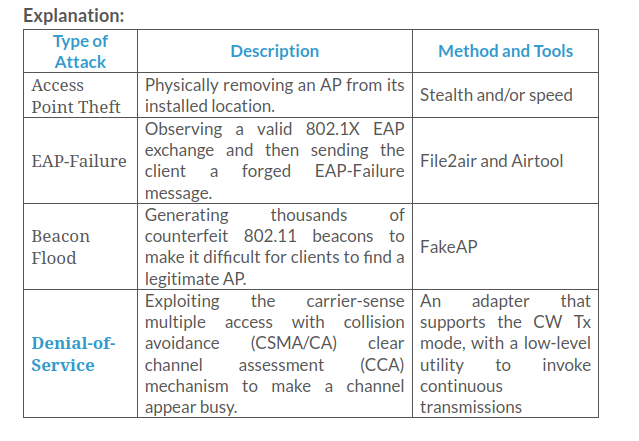
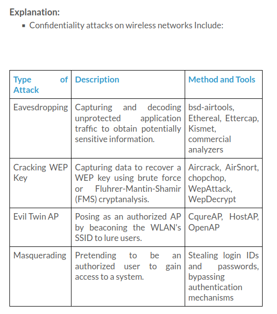
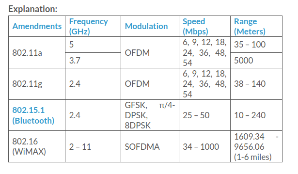
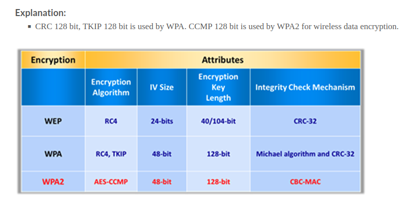

### Which of the following technologies is an air interface for 4G and 5G broadband wireless communications?

- FHSS
- OFDM
- DSSS
- **MIMO-OFDM**

Explanation:

    
>**Orthogonal Frequency-division Multiplexing (OFDM)**: Method of encoding digital data on multiple carrier frequencies
    
>**Frequency-hopping Spread Spectrum (FHSS)**: A method of transmitting radio signals by rapidly switching a carrier among many frequency channels.
    
>**Multiple input, multiple output orthogonal frequency-division multiplexing (MIMO-OFDM)**: An air interface for 4G and 5G broadband wireless communications
    
>**Direct-sequence Spread Spectrum (DSSS)**: An original data signal multiplied with a pseudo-random noise spreading the code

### In which of the following is the original data signal multiplied with a pseudo random noise spreading code?

- Frequency-hopping Spread Spectrum (FHSS)
- Orthogonal Frequency-division Multiplexing (OFDM)
- **Direct-sequence Spread Spectrum (DSSS)**
- Multiple input, multiple output orthogonal frequency-division multiplexing (MIMO-OFDM)

Explanation:

    
> **Orthogonal Frequency-division Multiplexing (OFDM)**: OFDM is a method of digital modulation of data in which a signal, at a chosen frequency, is split into multiple carrier frequencies that are orthogonal (occurring at right angles) to each other. OFDM maps information on the changes in the carrier phase, frequency, or amplitude, or a combination of these, and shares bandwidth with other independent channels.
    
> **Multiple input, multiple output-orthogonal frequency-division multiplexing (MIMO-OFDM)**: MIMO-OFDM influences the spectral efficiency of 4G and 5G wireless communication services. Adopting the MIMO-OFDM technique reduces the interference and increases how robust the channel is.
    
> **Direct-sequence Spread Spectrum (DSSS)**: DSSS is a spread spectrum technique that multiplies the original data signal with a pseudo random noise spreading code. Also referred to as a data transmission scheme or modulation scheme, the technique protects signals against interference or jamming.
    
> **Frequency-hopping Spread Spectrum (FHSS)**: Frequency-hopping Spread Spectrum (FHSS) is the method of transmitting radio signals by rapidly switching a carrier among many frequency channels. Direct-sequence Spread Spectrum (DSSS) refers to the original data signal and is multiplied with a pseudo random noise spreading code. Multiple input, multiple output orthogonal frequency-division multiplexing (MIMO-OFDM) is an air interface for 4G and 5G broadband wireless communications and Orthogonal Frequency-division Multiplexing (OFDM) is the method of encoding digital data on multiple carrier frequencies.

### Which of the following is a standard for Wireless Local Area Networks (WLANs) that provides improved encryption for networks that use 802.11a, 802.11b, and 802.11g standards?

- **802.11i**
- 802.11n
- 802.11d
- 802.11e

Explanation:

    
>**802.11n**: The IEEE 802.11n is a revision that enhances the earlier 802.11g standards with multiple-input multiple-output (MIMO) antennas. It works in both the 2.4 GHz and 5 GHz bands. This is an IEEE industry standard for Wi-Fi wireless local network transportations. Digital Audio Broadcasting (DAB) and Wireless LAN use OFDM.
    
>**802.11i**: The IEEE 802.11i standard improves WLAN security by implementing new encryption protocols such as TKIP and AES. It is a standard for wireless local area networks (WLANs) that provides improved encryption for networks that use the popular 802.11a, 802.11b (which includes Wi-Fi) and 802.11g standards.
    
>**802.11d**: The 802.11d is an enhanced version of 802.11a and 802.11b. The standard supports regulatory domains. The particulars of this standard can be set at the media access control (MAC) layer.
    
>**802.11e**: It is used for real-time applications such as voice, VoIP, and video. To ensure that these time-sensitive applications have the network resources they need, 802.11e defines mechanisms to ensure Quality of Service (QoS) to Layer 2 of the reference model, the medium-access layer, or MAC.

### Which of the following Wi-Fi security protocols uses GCMP-256 for encryption and HMAC-SHA-384 for authentication?

- CCMP
- WEP
- PEAP
- **WPA3**

Explanation:

> **PEAP**: A protocol that encapsulates the EAP within an encrypted and authenticated transport layer security (TLS) tunnel.

> **WEP**: An encryption algorithm for IEEE 802.11 wireless networks.
    
>**CCMP**: It is an encryption protocol used in WPA2 for strong encryption and authentication.
    
>**WPA3**: It is a third-generation Wi-Fi security protocol that provides new features for personal and enterprise usage. It uses Galois/Counter Mode-256 (GCMP-256) for encryption and the 384-bit hash message authentication code with the Secure Hash Algorithm (HMAC-SHA-384) for authentication.

### Which of the following cryptographic algorithms is used by CCMP?

- DES
- TKIP
- RC4
- **AES**

Explanation:

>CCMP is an encryption protocol used in WPA2 for stronger encryption and authentication. WPA2 is an upgrade to WPA using AES and CCMP for wireless data encryption. WPA2 introduces the use of the National Institute of Standards and Technology (NIST) FIPS 140-2-compliant AES encryption algorithm, a strong wireless encryption, and counter mode cipher block chaining message authentication code protocol (CCMP). It provides stronger data protection and network access control. It gives a high level of security to Wi-Fi connections, so that only authorized users can access it.

### Which of the following does not provide cryptographic integrity protection?

- WPA
- TKIP
- **WEP**
- WPA2

Explanation:

>WEP does not provide cryptographic integrity protection. By capturing two packets, an attacker can flip a bit in the encrypted stream and modify the checksum so that the packet is accepted.

### Which of the following protocol encapsulates the EAP within an encrypted and authenticated Transport Layer Security (TLS) tunnel?

- RADIUS
- CCMP
- LEAP
- **PEAP**

Explanation:

    
>**RADIUS**: It is a centralized authentication and authorization management system.
    
>**PEAP**: It is a protocol that encapsulates the EAP within an encrypted and authenticated Transport Layer Security (TLS) tunnel.
    
>**LEAP**: It is a proprietary version of EAP developed by Cisco.
    
>**CCMP**: It is an encryption protocol used in WPA2 for stronger encryption and authentication.

### Which of the following consists of 40/104 bit Encryption Key Length?

- RSA
- WPA
- **WEP**
- WPA2

Explanation:

> The length of the WEP and the secret key are:

> 64-bit WEP uses a 40-bit key

> 128-bit WEP uses a 104-bit key size

> 256-bit WEP uses 232-bit key size
    
> WEP normally uses a 40-bit or 104-bit encryption key, whereas TKIP in WPAuses 128-bit keys for each packet. The message integrity check for WPA avoids the chances of the attacker changing or resending the packets.
    
> WPA2 uses AES-CCMP encryption using 128 bit keys.
    
> RSA is public key encryption algorithm.

### In which of the following types of attack does an attacker exploit the carrier-sense multiple access with collision avoidance (CSMA/CA) clear channel assessment (CCA) mechanism to make a channel appear busy?

- **Denial of service**
- EAP failure
- Access point theft
- Beacon flood

### Which of the following attack techniques is used by an attacker to send forged control, management, or data frames over a wireless network to misdirect wireless devices and perform other types of attacks such as DoS?

- Confidentiality attack
- Authentication attack
- Availability attack
- **Integrity attack**

Explanation:

    
>**Confidentiality Attacks**: These attacks attempt to intercept confidential information sent over wireless associations, regardless of whether they were sent in clear text or encrypted by Wi-Fi protocols.
    
>**Availability Attacks**: Availability attacks aim at obstructing the delivery of wireless services to legitimate users, either by crippling those resources or by denying them access to WLAN resources.
    
>**Authentication Attacks**: The objective of authentication attacks is to steal the identity of Wi-Fi clients, their personal information, login credentials, etc. to gain unauthorized access to network resources.
    
>**Integrity Attacks**: In integrity attacks, attackers send forged control, management, or data frames over a wireless network to misdirect the wireless devices to perform another type of attacks (e.g., DoS)

### Steven, a wireless network administrator, has just finished setting up his company’s wireless network. He has enabled various security features such as changing the default SSID and enabling strong encryption on the company’s wireless router. Steven decides to test the wireless network for confidentiality attacks to check whether an attacker can intercept information sent over wireless associations, whether sent in clear text or encrypted by Wi-Fi protocols. As a part of testing, he tries to capture and decode unprotected application traffic to obtain potentially sensitive information using hardware or software tools such as Ettercap, Kismet, Wireshark, etc. What type of wireless confidentiality attack is Steven trying to do?

- Masquerading
- WEP Key Cracking
- **Eavesdropping**
- Evil twin AP

### Which of the following attacks is an inter-chip privilege escalation attack, where an attacker exploits the underlying vulnerabilities in wireless chips that handle wireless communications such as Bluetooth and Wi-Fi?

- aLTEr attack
- **Wireless co-existence attack**
- AP MAC spoofing
- Evil twin

Explanation:

    
>**Wireless Co-Existence Attack**: An inter-chip privilege escalation attack exploits the underlying vulnerabilities in wireless chips that handle wireless communications such as Bluetooth and Wi-Fi. Manufacturers often design separate chips for Bluetooth and Wi-Fi. Alternatively, they design a combo chip for both types of wireless communications. Attackers leverage combo chips to exploit one chip to steal the data from another chip and make lateral moves to exploit other chips. For example, while sharing resources, a Bluetooth chip can directly capture credentials or other sensitive data from the Wi-Fi chip, or it can manipulate the traffic going through the Wi-Fi chip. This can cause a wireless co-existence attack, which may lead to privilege escalation at chip boundaries.
    
>**AP MAC Spoofing**: An attacker can spoof the MAC address of the AP by programming a rogue AP to advertise the same identity information as that of the legitimate AP. An attacker connected to the AP as an authorized client can have full access to the network..
    
>**Evil Twin**: An evil twin is a wireless AP that pretends to be a legitimate AP by imitating its SSID. It poses a clear and present danger to wireless users on private and public WLANs. An attacker sets up a rogue AP outside the network perimeter and lures users to sign into this AP.
    
>**aLTEr Attack**: The aLTEr attack is usually performed on LTE devices that encrypt user data in the AES counter (AES-CTR) mode, which provides no integrity protection.

### In a GNSS spoofing technique, attackers track the receiver’s position and identify the deviation from the original location to a fake one. Identify this technique.

- **Drag-off strategy**
- Cancellation methodology
- Meaconing method
- Interrupting the lock mechanism

Explanation:

    
>**Cancellation Methodology**: Attackers use dual signal transmission to cancel out individual spoofed signals by introducing false satellite data. The targeted signals are initially spoofed, where the latter is added with a false component that deceives the targeted GNSS receiver. This method is beneficial to the attacker in terms of extracting the code phase data but limited in terms of obtaining the amplitude matching and carrier phase.
    
>**Meaconing Method**: Attackers aim to block and re-broadcast the original signals for masking the actual signal toward the targeted receiver. This attack is effective with mono- and multi-antenna meaconers that control multiple satellites and allows attackers to manipulate the original signal with false positioning data and delay timings. Attackers prefer this method when it is impossible for a spoofer to generate a spreading sequence.
    
>**Drag-off Strategy**: Attackers track the receiver’s position and identify the deviation from the original location to a fake one. Attackers initiate this technique by mirroring the original navigation signals, injecting a progressive misalignment between those signals, and forwarding them to the GNSS receiver. The drag-off strategy is an effective attack that protects attackers from detection by radar systems.
    
>**Interrupting the Lock Mechanism**: Attackers aim to discover a GNSS receiver’s new lock via a faulty signal. Attackers initiate this process by radiating a jamming signal inside the GNSS receiver, where the receiver requests for the next acquisition. Then, a signal simulator is used to generate a false signal, transmit it to the GNSS targeted receiver, and gain the new lock data of the receiver.

### Which of the following tools is used by an attacker to create rogue APs and perform sniffing and MITM attacks?

- Halberd
- Skyhook
- **MANA Toolkit**
- Gobuster

Explanation:

    
>**Halberd**: You can use Halberd to identify the real IP address of load balancers. When organizations implement load balancers, their real IP address is hidden behind a virtual IP address.
    
>**Gobuster**: Gobuster is a Go-programming-based directory scanner that allows attackers to perform fast-paced enumeration of hidden files and directories of a target web application.
    
>**Skyhook**: Skyhook is a GPS mapping tool.
    
>**MANA Toolkit**: MANA Toolkit comprises a set of tools that are used by the attackers for creating rogue APs and perform sniffing attacks and MITM attack.

### Which of the following security standards contains the Dragonblood vulnerabilities that help attackers recover keys, downgrade security mechanisms, and launch various information-theft attacks?

- WPA
- **WPA3**
- WPA2
- WEP

Explanation:

   
> **WPA2**: Hole96 vulnerability makes WPA2 vulnerable to MITM and DoS attacks.
    
> **WPA**: Vulnerabilities in TKIP allow attackers to guess the IP address of the subnet.
    
> **WPA3**: Dragonblood vulnerabilities in WPA3 allow attackers to recover keys, downgrade security mechanisms, and launch various information-theft attacks
    
> **WEP**: IV is a part of the RC4 encryption key, which leads to an analytical attack 

### During a wireless penetration test, a tester detects an AP using the WPA2 encryption. Which of the following attacks should be used to obtain the key?

- The tester cannot crack WPA2 because it is in full compliance with the IEEE 802.11i standard.
- The tester must change the MAC address of the wireless network card and then use the AirTraf tool to obtain the key.
- The tester must use the tool inSSIDer to crack it using the ESSID of the network.
- **The tester must capture the WPA2 authentication handshake and then crack it.**

Explanation:

    
> An attacker may succeed in unauthorized access to the target network by trying various method such as launching various wireless attacks, placing rogue APs, evil twins, etc. The next step for the attacker is to crack the security imposed by the target wireless network. Generally, a Wi-Fi network uses WEP or WPA/WPA2 encryption for securing wireless communication. The attacker now tries to break the security of the target wireless network by cracking these encryptions systems. Let us see how an attacker cracks these encryption systems to breach wireless network security.
    
> WPA encryption is less exploitable than WEP encryption. However, an attacker can still crack WPA/WPA2 by capturing the right type of packets. The attacker can perform this offline and needs to be near the AP for a few moments in order to capture the WPA/WPA2 authentication handshake.

### Mark is working as a penetration tester in InfoSEC, Inc. One day, he notices that the traffic on the internal wireless router suddenly increases by more than 50%. He knows that the company is using a wireless 802.11 a/b/g/n/ac network. He decided to capture live packets and browse the traffic to investigate the issue to find out the actual cause. Which of the following tools should Mark use to monitor the wireless network?

- WiFiFoFum
- BlueScan
- WiFish Finder
- **CommView for Wi-Fi**

Explanation:

    
> **CommView for WiFi**: CommView for Wi-Fi is a wireless network monitor and analyzer for 802.11 a/b/g/n networks. It captures packets to display important information such as the list of APs and stations, per-node and per-channel statistics, signal strength, a list of packets and network connections, protocol distribution charts, etc. By providing this information, CommView for Wi-Fi can view and examine packets, pinpoint network problems, and troubleshoot software and hardware.
    
> **WiFiFoFum**: WiFiFoFum is a wardriving app to locate, display and map found WiFi networks. WiFiFoFum scans for 802.11 Wi-Fi networks and displays information about each including: SSID, MAC, RSSI, channel, and security. WiFiFoFum also allows you to connect to networks you find and log the location using the GPS. KML logs can be emailed.
    
> **BlueScan**: BlueScan is a bash script that implements a scanner to detect Bluetooth devices that are within the range of our system. BlueScan works in a non-intrusive way, that is, without establishing a connection with the devices found and without being detected. Superuser privileges are not necessary to execute it.
    
> **WiFish Finder**: WiFish Finder is a tool for assessing whether WiFi devices active in the air are vulnerable to ‘Wi-Fishing’ attacks. Assessment is performed through a combination of passive traffic sniffing and active probing techniques. Most WiFi clients keep a memory of networks (SSIDs) they have connected to in the past. Wi-Fish Finder first builds a list of probed networks and then using a set of clever techniques also determines security setting of each probed network. A client is a fishing target if it is actively seeking to connect to an OPEN or a WEP network.

### In which of the following Bluetooth threats does an attacker trick Bluetooth users into lowering security or disabling authentication for Bluetooth connections to pair with them and steal information?

- Protocol exploitation
- Malicious code
- **Social engineering**
- Bugging devices

Explanation:

    
> **Bugging Devices**: Attackers can instruct a smartphone to make a call to other phones without any user interaction. They can even record a user’s conversations.
    
> **Social Engineering**: Attackers can trick Bluetooth users into lowering security or disabling authentication for Bluetooth connections to pair with them and steal their information
    
> **Malicious Code**: Smartphone worms can exploit a Bluetooth connection to replicate and spread itself.
    
> **Protocol exploitation**: Attackers exploit Bluetooth parings and communication protocols to steal data, make calls, send messages, launch DoS attacks on a device, spy on phones, etc.

### Which of the following btlejack commands allows an attacker to sniff new Bluetooth low-energy connections? 

- btlejack -s
- btlejack -d /dev/ttyACM0 -d /dev/ttyACM2 -s
- **btlejack -c any**
- btlejack -f 0x129f3244 -j

Explanation:

    
> **btlejack -f 0x129f3244 -j** [To perform a jamming operation]
    
> **btlejack -s** [To sniff an existing connection]
    
> **btlejack -c any** [To sniff for new connections]
    
> **btlejack -d /dev/ttyACM0 -d /dev/ttyACM2 -s** [To select target devices]

### Which of the following techniques involves sending unsolicited messages over Bluetooth to Bluetooth-enabled devices such as mobile phones and laptops?

- Bluesmacking
- Bluebugging
- BluePrinting
- **Bluejacking**

Explanation:

    
> **Bluejacking**: The art of sending unsolicited messages over Bluetooth to Bluetooth-enabled devices, such as mobile phones and laptops.
    
> **Bluesmacking**: DoS attack, which overflows Bluetooth-enabled devices with random packets, causes the devices to crash.
    
> **Bluebugging**: Remotely accessing a Bluetooth-enabled device and using its features.
    
> **BluePrinting**: The art of collecting information about Bluetooth-enabled devices, such as manufacturer, device model, and firmware version.

### An attacker collects the make and model of target Bluetooth-enabled devices analyzes them in an attempt to find out whether the devices are in the range of vulnerability to exploit. Identify which type of attack is performed on Bluetooth devices.

- MAC Spoofing Attack
- **BluePrinting**
- BlueSniff
- Bluebugging

Explanation:

    
> **BlueSniff**: BlueSniff is a proof of concept code for a Bluetooth wardriving utility. It is useful for finding hidden and discoverable Bluetooth devices.
    
> **Bluebugging**: Bluebugging is an attack in which an attacker gains remote access to a target Bluetooth-enabled device without the victim being aware of it. In this attack, an attacker sniffs sensitive information and might perform malicious activities such as intercepting phone calls and messages, forwarding calls and text messages, etc.
    
> **BluePrinting**: BluePrinting is a footprinting technique performed by an attacker in order to determine the make and model of the target Bluetooth-enabled device. Attackers collect this information to identify model, manufacturer, etc. and analyze them in an attempt to find out whether the devices are in the range of vulnerability to exploit.
    
> **MAC Spoofing Attack**: MAC Spoofing Attack is a passive attack in which attackers spoof the MAC address of the target Bluetooth-enabled device, in order to intercept or manipulate the data sent towards the target device.

### Which of the following countermeasures helps in defending against Bluetooth hacking?

- Place a firewall or packet filter between the AP and the corporate intranet.
- Implement an additional technique for encrypting traffic, such as IPSEC over wireless.
- Check the wireless devices for configuration or setup problems regularly.
- **Use non-regular patterns as PIN keys while pairing a device. Use those key combinations that are non-sequential on the keypad.**

Explanation:

> SSID Settings Best Practices

>   - Use SSID cloaking to keep certain default wireless messages from broadcasting the ID to everyone.
>   - Do not use your SSID, company name, network name, or any easy to guess string in passphrases.
>   - Place a firewall or packet filter in between the AP and the corporate Intranet.
>   - Limit the strength of the wireless network so it cannot be detected outside the bounds of your organization.
>   - Check the wireless devices for configuration or setup problems regularly.
>   - Implement an additional technique for encrypting traffic, such as IPSEC over wireless.
>   - Some of the countermeasures to defend against Bluetooth hacking:
>   - Use non-regular patterns as PIN keys while pairing a device. Use those key combinations which are non-sequential on the keypad.
>   - Keep BT in the disabled state, enable it only when needed and disable immediately after the intended task is completed.
>   - Keep the device in non-discoverable (hidden) mode.
>   - DO NOT accept any unknown and unexpected request for pairing your device.
>   - Keep a check of all paired devices in the past from time to time and delete any paired device that you are not sure about.
>   - Always enable encryption when establishing BT connection to your PC.
>   - Set Bluetooth-enabled device network range to the lowest and perform pairing only in a secure area.
>   - Install antivirus that supports host-based security software on Bluetooth-enabled devices.
>   - If multiple wireless communications are being used, make sure that encryption is empowered on each link in the communication chain.

### Which of the following practices helps manufacturers protect their devices against GNSS spoofing attacks?

- Never deploy spatial-based processing with space-time adaptive processing (STAP).
- **Deploy defensive devices such as antennae and radio spectra against software attacks.**
- Do not correlate the GNSS timing with other timing sources such as inertial measurement units (IMUs).
- Avoid deploying GNSS cryptographic methods such as spreading code encryption (SCE).

Explanation:

> The following are the countermeasures to detect and defend against GNSS spoofing:
>   - Deploy defensive methods while processing signals. Although signals in GNSS at the receiver-end system are processed in several stages, false signals can be monitored and detected by their absolute signal power, signal Doppler effect, signal peaks, and clock bias.
>   - Correlate the GNSS timing with other timing sources such as inertial measurement units (IMUs) that verify GNSS data.
>   - Deploy GNSS cryptographic methods such as spreading code encryption (SCE), navigation message authentication/encryption (NMA/NME), and TESLA to prevent the regeneration of the attacker’s faulty code.
>   - Deploy defensive devices such as antennae and radio spectra against software attacks.
>   - Deploy spatial-based processing with space-time adaptive processing (STAP), which assists in preventing interference and multipath replicas.

### Which of the following practices help security professionals in defending their network against wireless attacks?

- **Modify the SSID with some unique characters and strings.**
- Never place a firewall or packet filter between an AP and the corporate Intranet.
- Avoid using SSID cloaking.
- Do not limit the strength of the wireless network so that it can be detected outside the bounds of the organization.

Explanation:

> Defense Against Wireless Attacks
>   - Use SSID cloaking to keep certain default wireless messages from broadcasting the SSID to everyone.
>   - Place a firewall or packet filter between an AP and the corporate Intranet.
>   - Modify the SSID with some unique characters and strings, instead of using the manufacturer’s default SSID.
>   - Limit the strength of the wireless network so that it cannot be detected outside the bounds of the organization.
>  - Separate the organizational network into multiple zones with their own SSIDs to reduce the level of exploitation during attacks.

### Which of the following wireless standards uses modulation schemes such as GFSK, π/4-DPSK, and 8DPSK and a frequency of 2.4 GHz with data transfer rates in the range of 25–50 Mbps?

- **802.15.1 (Bluetooth)**
- 802.11g
- 802.16 (WiMAX)
- 802.11a

### WPA2 uses AES for wireless data encryption at which of the following encryption levels?

- 128 bit and TKIP
- 64 bit and CCMP
- **128 bit and CCMP**
- 128 bit and CRC

### Which of the following tools is designed to capture a WPA/WPA2 handshake and act as an ad-hoc AP?

- Airodump-ng
- Airmon-ng
- **Airbase-ng**
- Airolib-ng

Explanation:

> **Airmon-ng**: Used to enable monitor mode on wireless interfaces from managed mode and vice versa.

> **Airbase-ng**: Captures WPA/WPA2 handshake and can act as an ad-hoc AP.

> **Airolib-ng**: Stores and manages essid and password lists used in WPA/WPA2 cracking.

> **Airodump-ng**: Used to capture packets of raw 802.11 frames and collect WEP IVs.

### Kenneth, a professional penetration tester, was hired by the XYZ Company to conduct wireless network penetration testing. Kenneth proceeds with the standard steps of wireless penetration testing. He tries to collect lots of initialization vectors (IVs) using the injection method to crack the WEP key. He uses the aircrack-ng tool to capture the IVs from a specific AP. Which of the following aircrack-ng commands will help Kenneth to do this?

- airmon-ng start wifi0 9
- aireplay-ng -9 -e teddy -a 00:14:6C:7E:40:80 ath0
- aireplay-ng -1 0 -e teddy -a 00:14:6C:7E:40:80 -h 00:0F:B5:88:AC:82 ath0
- **airodump-ng -c 9 -- bssid 00:14:6C:7E:40:80 -w output ath0**

Explanation:

> Start airodump-ng to capture the IVs: The purpose of this step is to capture the IVs generated. This step starts airodump-ng to capture the IVs from the specific AP. Open another console session to capture the generated IVs. Then enter:

> `airodump-ng -c 9 --bssid 00:14:6C:7E:40:80 -w output ath0`

>Where:
> - -c 9 is the channel for the wireless network
> - --bssid 00:14:6C:7E:40:80 is the AP MAC address. This eliminates extraneous traffic.
> - -w capture is file name prefix for the file which will contain the IVs.
> - ath0 is the interface name.

> Test Wireless Device Packet Injection: The purpose of this step ensures that your card is within distance of your AP and can inject packets to it. Enter:

> `aireplay-ng -9 -e teddy -a 00:14:6C:7E:40:80  ath0`

> Where:
> - -9 means injection test
> - -e teddy is the wireless network name
>- -a 00:14:6C:7E:40:80 is the AP MAC address
> - ath0 is the wireless interface name

> Start the wireless card: Enter the following command to start the wireless card on channel 9 in monitor mode:

> `airmon-ng start wifi0 9`

> Substitute the channel number that your AP runs on for “9” in the command above.

> Use **aireplay-ng to do a fake authentication with the AP**: In order for an AP to accept a packet, the source MAC address must already be associated. If the source MAC address you are injecting is not associated then the AP ignores the packet and sends out a “DeAuthentication” packet in cleartext. In this state, no new IVs are created because the AP is ignoring all the injected packets.

> To associate with an AP, use fake authentication:

> `aireplay-ng -1 0 -e teddy -a 00:14:6C:7E:40:80 -h 00:0F:B5:88:AC:82 ath0`

> Where:
> - -1 means fake authentication
> - 0 reassociation timing in seconds
> - -e teddy is the wireless network name
> - -a 00:14:6C:7E:40:80 is the AP MAC address
> - -h 00:0F:B5:88:AC:82 is our card MAC address
> - ath0 is the wireless interface name
