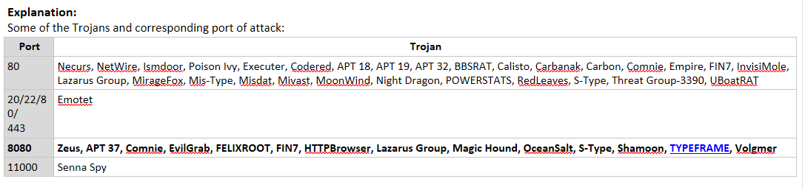
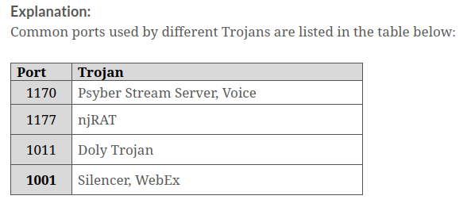

### Which of the following techniques is used by an attacker to mimic legitimate institutions such as banks and steal sensitive information such as login passwords and credit-card and bank-account data?

- **Spear-phishing sites**
- Malvertising
- Black-hat SEO
- Social-engineered click-jacking 

Explanation:

>**Black hat Search Engine Optimization (SEO)**: Black hat SEO (also referred to as unethical SEO) uses aggressive SEO tactics such as keyword stuffing, inserting doorway pages, page swapping, and adding unrelated keywords to get higher search engine rankings for malware pages.

>**Spear-phishing Sites**: This technique is used for mimicking legitimate institutions to steal login credentials such as banks, to steal passwords, credit card, and bank account data, and other sensitive information.

>**Social Engineered Click-jacking**: Attackers inject malware into websites that appear legitimate to trick users into clicking them. When clicked, the malware embedded in the link executes without the knowledge or consent of the user.

>**Malvertising**: This technique involves embedding malware-laden advertisements in legitimate online advertising channels to spread malware on systems of unsuspecting users.

### Which of the following techniques opens the door for malware entry when users and IT administrators do not update their application software as often as they should?

- Browser and email software bugs
- Instant messenger applications
- **Insecure patch management**
- Network propagation

Explanation:

>**Browser and Email Software Bugs**: Outdated web browsers often contain vulnerabilities that can pose a major risk to the user’s computer. A visit to a malicious site from such browsers can automatically infect the machine without downloading or executing any program.

>**Insecure Patch management**: Unpatched software poses a high risk. Users and IT administrators do not update their application software as often as they should, and many attackers take advantage of this well-known fact.

>**Instant Messenger Applications**: Infection can occur via instant messenger applications such as Facebook Messenger, WhatsApp Messenger, LinkedIn Messenger, Google Hangouts, or ICQ. Users are at high risk while receiving files via instant messengers.

>**Network Propagation**: various factors such as the replacement of network firewalls and mistakes of operators may sometimes allow unfiltered Internet traffic into private networks.

### In which of the following techniques does an attacker use tactics such as keyword stuffing, inserting doorway pages, page swapping, and adding unrelated keywords to obtain higher rankings for malware pages on a web search?

- Malvertising
- Compromised legitimate websites
- **Black-hat search engine optimization** 
- Social-engineered click-jacking

Explanation:

>**Social Engineered Click-jacking**: Attackers inject malware into websites that appear legitimate to trick users into clicking them. When clicked, the malware embedded in the link executes without the knowledge or consent of the user.

>**Malvertising**: This technique involves embedding malware-laden advertisements in legitimate online advertising channels to spread malware on systems of unsuspecting users.

>**Black hat Search Engine Optimization (SEO)**: Black hat SEO (also referred to as unethical SEO) uses aggressive SEO tactics such as keyword stuffing, inserting doorway pages, page swapping, and adding unrelated keywords to get higher search engine rankings for malware pages.

>**Compromised Legitimate Websites**: Often, attackers use compromised websites to infect systems with malware. When an unsuspecting user visits the compromised website, he/she unknowingly installs the malware on his/her system, after which the malware performs malicious activities.

### Which of the following channels is used by an attacker to hide data in an undetectable protocol?

- Encrypted
- **Covert**
- Overt
- Classified

Explanation:

>“**Overt**” refers something that is explicit, obvious, or evident, whereas “covert” refers to something that is secret, concealed, or hidden. An overt channel is a legal channel for the transfer of data or information in a company network and works securely to transfer data and information. On the other hand, a covert channel is an illegal, hidden path used to transfer data from a network.

>**Covert channels** are methods attackers can use to hide data in an undetectable protocol. They rely on a technique called tunneling, which enables one protocol to transmit over the other. Any process or a bit of data can be a covert channel. This makes it an attractive mode of transmission for a Trojan because an attacker can use the covert channel to install a backdoor on the target machine.

### How does an attacker perform a “social engineered clickjacking” attack?

- By attaching a malicious file to an e-mail and sending the e-mail to a multiple target address
- By exploiting flaws in browser software to install malware merely by visiting a website
- **By injecting malware into legitimate-looking websites to trick users by clicking them**
- By mimicking legitimate institutions, such as banks, in an attempt to steal passwords and credit card

Explanation:

>In social engineered clickjacking technique, attackers inject malware into legitimate-looking websites to trick users by clicking them. When clicked, the malware embedded in the link executes without the knowledge or consent of the user.

### Which of the following port numbers is used by the Trojans Zeus, OceanSalt, and Shamoon?

- Port 80
- Port 443
- Port 11000
- **Port 8080**

### Which of the following types of Trojans is used by an attacker to create fake form fields on e-banking pages and collect the target’s account details, credit-card number, and date of birth to impersonate the target and compromise their account?

- TAN grabber
- Covert credential grabber
- Form grabber
- **HTML injection**

Explanation:

>The working of a banking Trojan includes the following:

>**TAN Gabber**: A Transaction Authentication Number (TAN) is a single-use password for authenticating online banking transactions. Banking Trojans intercept valid TANs entered by users and replace them with random numbers. The bank will reject such invalid random numbers. Subsequently, the attacker misuses the intercepted TAN with the target’s login details.

>**HTML Injection**: The Trojan creates fake form fields on e-banking pages, thereby enabling the attacker to collect the target’s account details, credit card number, date of birth, etc. The attacker can use this information to impersonate the target and compromise his/her account.

>**Form Grabber**: A form grabber is a type of malware that captures a target’s sensitive data such as IDs and passwords, from a web browser form or page. It is an advanced method for collecting the target’s Internet banking information. It analyses POST requests and responses to the victim's browser. It compromises the scramble pad authentication and intercepts the scramble pad input as the user enters his/her Customer Number and Personal Access Code.

>**Covert Credential Grabber**: This type of malware remains dormant until the user performs an online financial transaction. It works covertly to replicate itself on the computer and edits the registry entries each time the computer is started. The Trojan also searches the cookie files that had been stored on the computer while browsing financial websites. Once the user attempts to make an online transaction, the Trojan covertly steals the login credentials and transmits them to the hacker. 

### Which of the following techniques is used by an attacker to deploy a Trojan through a legal channel for securely transferring data or information in a company network?

- **Overt channel**
- Proxy servers
- Covert channel
- USB/flash drives

Explanation:

>**USB/Flash Drives**: An attacker can also transfer the Trojan package onto a USB drive and trick the victim into using the USB drive on the target system. Sometimes, attackers just drop a USB drive and wait for a random victim to pick it up. Once the USB drive is picked up and inserted into the target system by the innocent victim, the Trojan is propagated on the system by the drop or download method, depending on the type of packaging technique used by the attacker.

>**Overt Channel**: It is a legal channel for the transfer of data or information in a company network, and it works securely to transfer data and information

>**Covert Channel**: A channel that transfers information within a computer system or network in a way that violates the security policy. An example of a covert channel is the communication between a Trojan and its command-and-control center

>**Proxy Servers**: A Trojan proxy is usually a standalone application that allows remote attackers to use the victim’s computer as a proxy to connect to the target machine. Attackers compromise several computers and start using them as hidden proxy servers.

### A covert channel is a channel that:

- Transfers information over, within a computer system, or network that is within the security policy.
- Transfers information via a communication path within a computer system, or network for transfer of data.
- Transfers information over, within a computer system, or network that is encrypted.
- **Transfers information over, within a computer system, or network that is outside of the security policy.**

Explanation:

>“**Overt**” refers to something that is explicit, obvious, or evident, whereas “covert” refers to something that is secret, concealed, or hidden. An overt channel is a legal channel for the transfer of data or information in a company network and works securely to transfer data and information. On the other hand, a covert channel is an illegal, hidden path used to transfer data from a network.

>**Covert channels** are methods attackers can use to hide data in an undetectable protocol. They rely on a technique called tunneling, which enables one protocol to transmit over the other. Any process or a bit of data can be a covert channel. This makes it an attractive mode of transmission for a Trojan because an attacker can use the covert channel to install a backdoor on the target machine.

### Which of the following Rootkit Trojans performs targeted attacks against various organizations and arrives on the infected system by being downloaded and executed by the Trickler dubbed "DoubleFantasy," covered by TSL20110614-01 (Trojan.Win32.Micstus.A)?

- **EquationDrug rootkit**
- GrayFish rootkit
- Boot loader level rootkit
- Hardware/firmware rootkit

Explanation:

>**GrayFish Rootkit**: GrayFish is a Windows kernel rootkit that runs inside the Windows operating system and provides an effective mechanism, hidden storage and malicious command execution while remaining invisible. It injects its malicious code into the boot record which handles the launching of Windows at each step. It implements its own Virtual File System (VFS) to store the stolen data and its own auxiliary information.

>**Hardware/Firmware Rootkit**: Hardware/firmware rootkits use devices or platform firmware to create a persistent malware image in hardware, such as a hard drive, system BIOS, or network card. The rootkit hides in firmware as the users do not inspect it for code integrity. A firmware rootkit implies the use of creating a permanent delusion of rootkit malware.

>**Boot Loader Level Rootkit**: Boot loader level (bootkit) rootkits function either by replacing or modifying the legitimate bootloader with another one.The boot loader level (bootkit) can activate even before the operating system starts. So, the boot-loader-level (bootkit) rootkits are serious threats to security because they can help in hacking encryption keys and passwords.

>**EquationDrug Rootkit**: EquationDrug is a dangerous computer rootkit that attacks the Windows platform. It performs targeted attacks against various organizations and arrives on the infected system by being downloaded and executed by the Trickler dubbed "DoubleFantasy", covered by TSL20110614-01 (Trojan.Win32.Micstus.A). It allows a remote attacker to execute shell commands on the infected system

### Which of the following is a program that is installed without the user’s knowledge and can bypass the standard system authentication or conventional system mechanism like IDS, firewalls, etc. without being detected?

- Remote Access Trojans
- Covert Channel Trojans
- **Backdoor Trojans**
- Proxy Server Trojans

Explanation:

>**Remote Access Trojans**: Remote access Trojans (RATs) provide attackers with full control over the victim’s system, enabling them to remotely access files, private conversations, accounting data, and others. The RAT acts as a server and listens on a port that is not supposed to be available to Internet attackers.

>**Proxy Server Trojans**: Trojan Proxy is usually a standalone application that allows remote attackers to use the victim’s computer as a proxy to connect to the Internet. Proxy server Trojan, when infected, starts a hidden proxy server on the victim’s computer. Attackers use it for anonymous Telnet, ICQ, or IRC to purchase goods using stolen credit cards, as well as other such illegal activities.

>**Backdoor Trojans**: A backdoor is a program which can bypass the standard system authentication or conventional system mechanism like IDS, firewalls, etc. without being detected. In these types of breaches, hackers leverage backdoor programs to access the victim’s computer or a network. The difference between this type of malware and other types of malware is that the installation of the backdoor is performed without the user’s knowledge. This allows the attack to perform any activity on the infected computer which can include transferring, modifying, corrupting files, installing malicious software, rebooting the machine, etc. without user detection.

>**Covert Channel Trojans**: Covert Channel Tunneling Tool (CCTT) Trojan presents various exploitation techniques, creating arbitrary data transfer channels in the data streams authorized by a network access control system. It enables attackers to get an external server shell from within the internal network and vice-versa. It sets a TCP/UDP/HTTP CONNECT|POST channel allowing TCP data streams (SSH, SMTP, POP, etc.) between an external server and a box from within the internal network.

### Which of the following types of viruses overwrites a part of the host file with a constant without increasing the length of the file and while preserving its functionality?

- Sparse infector viruses
- Metamorphic viruses
- **Cavity viruses**
- Polymorphic viruses

Explanation:

>**Sparse Infector Viruses**: To spread infection, viruses typically attempt to hide from antivirus programs. Sparse infector viruses infect less often and try to minimize their probability of discovery. These viruses infect only occasionally upon satisfying certain conditions or infect only those files whose lengths fall within a narrow range

>**Metamorphic Viruses**: Metamorphic viruses are programmed such that they rewrite themselves completely each time they infect a new executable file. Such viruses are sophisticated and use metamorphic engines for their execution. 

>**Cavity Viruses**: Some programs have empty spaces in them. Cavity viruses, also known as space fillers, overwrite a part of the host file with a constant (usually nulls), without increasing the length of the file while preserving its functionality. Maintaining a constant file size when infecting allows the virus to avoid detection. 

>**Polymorphic Viruses**: Such viruses infect a file with an encrypted copy of a polymorphic code already decoded by a decryption module. Polymorphic viruses modify their code for each replication to avoid detection.

### Which of the following types of viruses hides itself from antivirus programs by actively altering and corrupting service call interrupts while running?

- Macro viruses
- System or boot-sector viruses
- **Tunneling viruses**
- File viruses

Explanation:

>**Tunneling Viruses**: These viruses try to hide from antivirus programs by actively altering and corrupting the service call interrupts while running. The virus code replaces the requests to perform operations with respect to these service call interrupts. These viruses state false information to hide their presence from antivirus programs.

>**Macro Viruses**: Macro viruses infect Microsoft Word or similar applications by automatically performing a sequence of actions after triggering an application. Most macro viruses are written using the macro language Visual Basic for Applications (VBA), and they infect templates or convert infected documents into template files while maintaining their appearance of common document files.

>**File Viruses**: File viruses infect files executed or interpreted in the system, such as COM, EXE, SYS, OVL, OBJ, PRG, MNU, and BAT files. File viruses can be direct-action (non-resident) or memory-resident viruses.

>**System or Boot Sector Viruses**: The most common targets for a virus are the system sectors, which include the master boot record (MBR) and the DOS boot record system sectors. An OS executes code in these areas while booting. Every disk has some sort of system sector. MBRs are the most virus-prone zones because if the MBR is corrupted, all data will be lost. The DOS boot sector also executes during system booting. This is a crucial point of attack for viruses.

### Which of the following ransomware is delivered when an attacker uses the RIG exploit kit by taking advantage of outdated versions of applications such as Flash, Java, Silverlight, and Internet Explorer?

- NamPoHyu
- SamSam
- cryptgh0st
- **Cerber**

Explanation:

>**SamSam**, **NamPoHyu**, and **cryptgh0st** are ransomware that are not distributed by RIG EK.

>**Cerber** ransomware which is distributed by RIG EK.

### Which of the following malware is a self-replicating program that produces its code by attaching copies of itself to other executable codes and operates without the knowledge of the user?

- Exploit kit
- Worm
- **Virus**
- Trojan

Explanation:

>**Exploit Kits**: The attacker uses malicious script to exploit poorly patched vulnerabilities in an IoT device.

>**Worm**: Computer worms are standalone malicious programs that replicate, execute, and spread across network connections independently, without human intervention. Intruders design most worms to replicate and spread across a network, thus consuming available computing resources and in turn causing network servers, web servers, and individual computer systems to become overloaded and stop responding. However, some worms also carry a payload to damage the host system.

>**Trojan**: A Trojan is a program that masks itself as a benign application. The software initially appears to perform a desirable or benign function, but instead steals information or harms the system. With a Trojan, attackers can gain remote access and perform various operations limited by user privileges on the target computer

>**Virus**: A computer virus is a self-replicating program that produces its code by attaching copies of itself to other executable code and operates without the knowledge or consent of the user.

### Which of the following viruses infect only occasionally upon satisfying certain conditions or when the length of the file falls within a narrow range?

- Encryption viruses
- Cluster viruses
- **Sparse infector viruses**
- Stealth virus

Explanation:

>**Cluster viruses**: Cluster viruses infect files without changing the file or planting additional files. They save the virus code to the hard drive and overwrite the pointer in the directory entry, directing the disk read point to the virus code instead of the actual program.

>**Sparse infector viruses**: To spread infection, viruses typically attempt to hide from antivirus programs. Sparse infector viruses infect less often and try to minimize the probability of discovery. Sparse infector viruses infect only occasionally upon satisfying certain conditions or only files whose lengths fall within a narrow range.

>**Encryption viruses**: Encryption viruses block the access to target machines or provide victims with limited access to the system. This virus uses encryption to hide from virus scanner. It is not possible for the virus scanner to detect the encryption virus using signatures, but it can detect the decrypting module. They penetrate the target system via freeware, shareware, codecs, fake advertisements, torrents, email spam, and so on.

>**Stealth virus**: These viruses try to hide from antivirus programs by actively altering and corrupting the service call interrupts while running. The virus code replaces the requests to perform operations with respect to these service call interrupts. These viruses state false information to hide their presence from antivirus programs.

### Which of the following malware is a specially crafted ransomware comprising four encryption routines and supports several encryption algorithms such as ChaCha20 and AES?

- IExpress Wizard
- Spytech SpyAgent
- **BlackCat**
- Mirai

Explanation:

>**Spytech SpyAgent**: Spytech SpyAgent is computer spy software that allows you to monitor everything users do on your computer—in total secrecy.

>**Mirai**: Mirai is a self-propagating IoT botnet that infects poorly protected Internet devices (IoT devices). Mirai uses telnet port (23 or 2323) to find those devices that are still using their factory default username and password.

>**IExpress Wizard**: IExpress Wizard is a wrapper program that guides the user to create a self-extracting package that can automatically install the embedded setup files, Trojans, etc.

>**BlackCat**: BlackCat is a dreadful ransomware attack written in Rust and profoundly known as ALPHA (AlphaVM, AlphaV). It is specially crafted ransomware comprising 4 encryption routines and supports several encryption algorithms such as ChaCha20 and AES. The attack mainly focuses on crashing targeted devices and running processes, applications, and VMs during their encryption process. BlackCat employs phishing tactics on the victims by delivering its payload using vulnerable applications and exposed toolsets.

### Which of the following is Python-based fileless malware that spreads infections over Microsoft exchange servers and enterprise-level Linux machines and uses cryptojacking abilities to hide itself and stay intact even after security patches are applied?

- Restorator
- Mirai
- **LemonDuck**
- BasBanke

Explanation:

>**LemonDuck**: LemonDuck is Python-based fileless malware that spreads infections over Microsoft exchange servers and enterprise-level Linux machines worldwide. It removes other malware from the target system and uses cryptojacking abilities to hide itself and stay intact even after security patches are applied.

>**Restorator**: Restorator is a utility for editing Windows resources in applications and their components (e.g., files with .exe, .dll, .res, .rc, and .dcr extensions). It allows you to change, add, or remove resources such as text, images, icons, sounds, videos, versions, dialogs, and menus in nearly all programs. Using this tool, one can achieve translation/localization, customization, design improvement, and development.

>**BasBanke**: BasBanke is a Trojan family that runs on Android. The Trojan was first identified in 2018 during the Brazilian elections, registering over 10,000 installations as of April 2019 from the official Google Play Store alone.

>**Mirai**: Mirai is a self-propagating IoT botnet that infects poorly protected Internet devices (IoT devices). Mirai uses telnet port (23 or 2323) to find those devices that are still using their factory default username and password.

### In the below command, identify the parameter that displays active TCP connections and includes the process ID (PID) for each connection.netstat [-a] [-e] [-n] [-o] [-p Protocol] [-r] [-s] [Interval]

- [-n]
- **[-o]** 
- [-a]
- [-s]

Explanation:
>- -a: Displays all active TCP connections and the TCP and UDP ports on which the computer is listening.
>- -e: Displays Ethernet statistics, such as the number of bytes and packets sent and received. This parameter can be combined with -s.
>- -n: Displays active TCP connections; however, addresses and port numbers are expressed numerically, and no attempt is made to determine names.
>- -o: Displays active TCP connections and includes the process ID (PID) for each connection. You can find the application based on the PID in the Processes tab in Windows Task Manager. This parameter can be combined with -a, -n, and -p.
>- -p Protocol: Shows connections for the protocol specified by Protocol. In this case, Protocol can be tcp, udp, tcpv6, or udpv6. If this parameter is used with -s to display statistics by protocol, Protocol can be tcp, udp, icmp, ip, tcpv6, udpv6, icmpv6, or ipv6.
>- -s: Displays statistics by protocol. By default, statistics are shown for the TCP, UDP, ICMP, and IP protocols. If the IPv6 protocol for Windows XP is installed, statistics are shown for the TCP over IPv6, UDP over IPv6, ICMPv6, and IPv6 protocols. The -p parameter can be used to specify a set of protocols.
>- -r: Displays the contents of the IP routing table. This is equivalent to the route print command.

### By conducting which of the following monitoring techniques can a security professional identify the presence of any malware that manipulates HKEY_LOCAL_MACHINE\System\CurrentControlSet\Services registry keys to hide its processes?  

- Startup programs monitoring
- Installation monitoring 
- **Windows services monitoring**
- Process monitoring

Explanation:
>- Startup programs monitoring is used to detect suspicious startup programs and processes.
>- Installation monitoring helps in detecting hidden and background installations performed by malware.
>- Process monitoring is used to scan for suspicious processes.
>- Windows services monitoring traces malicious services initiated by the malware. Since malware employs rootkit techniques to manipulate HKEY_LOCAL_MACHINE\System\CurrentControlSet\Services registry keys to hide its processes, windows service monitoring can be used to identify such manipulations.

### Asher, a security analyst, was tasked with analyzing a recent malware incident at an organization. For this purpose, Asher employed a malware analysis platform that scans files, URLs, end points, and memory dumps. It helped Asher extract strings from the malware samples and in identifying whether those strings are used in other files. Identify the tool employed by Asher in the above scenario.

- xHelper
- **Intezer**
- cSploit
- Network Spoofer

Explanation:
> **xHelper**: Android/Trojan.Dropper.xHelper is a variant of Android/Trojan.Dropper.

> **cSploit**: cSploit is an Android network analysis and penetration suite that is used to map the local network, fingerprint hosts' operating systems and open ports, perform integrated traceroute, forge TCP/UDP packets, and perform MITM attacks such as password sniffing, JavaScript injection, capturing real-time network traffic, DNS spoofing, and session hijacking.

> **Intezer**: Intezer is malware analysis platform that scans files, URLs, end points, and memory dumps. It extracts strings from uploaded malware samples and identifies whether those strings are used in other files. It reduces the effort of malware analysts by analyzing unknown malware that is difficult to trace.

>**Network Spoofer**: Network Spoofer allows you to change websites on others’ computers via an Android phone.

### Which of the following is a cross-platform tool developed by QuarksLab for parsing and manipulating different executable formats including Mach-O binary formats? 

- DriverView
- **LIEF**
- Verisys
- Loggly

Explanation:

>**Loggly**: It is a log monitoring/analysis tool that can be used by security analysts as a primary source of information and helps in identifying security gaps with the systems or network. 

>**LIEF**: LIEF is an acronym for Library to Instrument Executable Formats. It is a cross-platform tool developed by QuarksLab for parsing and manipulating different executable formats including Mach-O binary formats.

>**Verisys**: It is a file integrity checking tool that can help analysts Scan for suspicious files and folders and detect any Trojans installed as well as system file 

>**DriverView**: The DriverView utility displays the list of all device drivers currently loaded in the system. For each driver in the list, additional information is displayed, such as the load address of the driver, description, version, product name, and maker.

### Identify the practice that helps security experts in securing an organizational network from fileless malware attacks.

- **Check if any PowerShell scripts are hidden in any of the drives or in the \TEMP folder.**
- Allow all incoming network traffic or files with the .exe format.
- Avoid using managed detection and response (MDR) services.
- Enable unused or unnecessary applications and service features.

Explanation:
>Some countermeasures against fileless malware attacks are as follows:
>- Disable unused or unnecessary applications and service features.
>- Block all the incoming network traffic or files with the .exe format.
>- Check if any PowerShell scripts are masked in any of the drives or in the \TEMP folder.
>- Use managed detection and response (MDR) services that can perform threat hunting.
>- Utilize projects such as AltFS, which provides insights into how fileless malware usually works on targeted devices.

### Which of the following practices makes an organizational network susceptible to fileless malware attacks?

- **Enable Flash in the browser settings.**
- Utilize projects such as AltFS.
- Disable PowerShell and WMI when not in use.
- Disable macros and use only digitally signed trusted macros.

Explanation:
>Some countermeasures against fileless malware attacks are as follows:
>- Disable PowerShell and WMI when not in use
>- Disable macros and use only digitally signed trusted macros
>- Disable PDF readers to run JavaScript automatically
>- Disable Flash in the browser settings
>- Check if any PowerShell scripts are masked in any of the drives or in the \TEMP folder.
>- Utilize projects such as AltFS, which provides insights into how fileless malware usually works on targeted devices.

### Which of the following tools is an antivirus program that is used to detect viruses?

- DriverView
- ZeuS
- **ClamWin**
- WannaCry

Explanation:
>**ClamWin**: ClamWin is a Free Antivirus program for Microsoft Windows 10 / 8 / 7 / Vista / XP / Me / 2000 / 98 and Windows Server 2012, 2008 and 2003.

>**WannaCry**: WannaCry is ransomware that on execution encrypts the files and locks the user's system thereby leaving the system in an unusable state. The compromised user has to pay ransom in bitcoins to the attacker to unlock the system and get the files decrypted.

>**ZeuS**: ZeuS, also known as Zbot, is a powerful banking trojan that explicitly attempts to steal confidential information like system information, online credentials, and banking details, etc. Zeus is spread mainly through drive-by downloads and phishing schemes.

>**DriverView**: DriverView utility displays the list of all device drivers currently loaded on the system. For each driver in the list, additional information is displayed such as load address of the driver, description, version, product name, company that created the driver, etc.

### Which of the following port numbers is used by Trojans such as Silencer and WebEx?

- 1170
- 1011
- **1001**
- 1177

### Which of the following types of Trojans intercepts the victim’s account information before the system can encrypt it and sends the intercepted information to the attacker's command-and-control center?

- Rootkit Trojans
- **E-banking Trojans**
- Destructive Trojans
- Backdoor Trojans

Explanation:

>**Rootkit Trojans**: Rootkits are potent backdoors that specifically attack the root or OS. Unlike backdoors, rootkits cannot be detected by observing services, system task lists, or registries. Rootkits provide full control of the victim OS to the attacker.

>**E-banking Trojans**: E-banking Trojans are extremely dangerous and have emerged as a significant threat to online banking. They intercept the victim's account information before the system can encrypt it and send it to the attacker's command-and-control center.

>**Backdoor Trojans**: A backdoor is a program that can bypass the standard system authentication or conventional system mechanisms such as IDS and firewalls without being detected. In these types of breaches, hackers leverage backdoor programs to access the victim’s computer or network.

>**Destructive Trojans**: The sole purpose of a destructive Trojan is to delete files on a target system. Antivirus software may not detect destructive Trojans.

### Which of the following Trojans uses port number 1863 to perform attack?

- Devil
- Priority
- **XtremeRAT**
- Millennium

### A hacker wants to encrypt and compress 32-bit executables and .NET apps without affecting their direct functionality. Which of the following cryptor tools should be used by the hacker?

- Java crypter
- **BitCrypter**
- Cypherx
- Hidden sight crypter

Explanation:

>An attacker can use BitCrypter to encrypt and compress 32-bit executables and .NET apps, without affecting their direct functionality. A Trojan or malicious software piece can be encrypted onto a legitimate software to bypass firewalls and antivirus software. BitCrypter supports a wide range of OSs from Windows XP to the latest Windows 10.

### In which of the following stages of the virus lifecycle does a user install antivirus updates and eliminate the virus threats?

- Replication
- **Execution of the damage routine**
- Detection
- Launch

Explanation:

>**Replication**: The virus replicates for a period within the target system and then spreads itself.

>**Launch**: The virus is activated when the user performs specific actions such as running an infected program.

>**Detection**: The virus is identified as a threat infecting the target system.

>**Execution of the damage routine**: Users install antivirus updates and eliminate the virus threats.

### Which of the following types of viruses transfers all controls of the host code to where it resides in the memory, selects the target program to be modified, and corrupts it?

- Add-on virus
- **Transient virus**
- Ransomware
- Armored virus

Explanation:

>**Transient Viruses**: Transient viruses transfer all controls of the host code to where it resides in the memory. It selects the target program to be modified and corrupts it.

>**Add-on Viruses**: Add-on viruses append their code to the host code without making any changes to the latter or relocate the host code to insert their code at the beginning.

>**Ransomware**: Ransomware is a type of malware that restricts access to the infected computer system or critical files and documents stored on it, and then demands an online ransom payment to the malware creator(s) to remove user restrictions.

>**Armored Viruses**: Armored viruses are viruses that are designed to confuse or trick deployed antivirus systems to prevent them from detecting the actual source of the infection.

### Mark, a professional hacker, was hired to disrupt the operations of an organization. In this process, he injected a virus into the target network that is designed to confuse or trick deployed antivirus systems for preventing them from detecting the actual source of the infection. Which of the following types of viruses did Mark use on the target organization?

- Web scripting virus
- **Armored virus**
- Logic bomb virus
- Add-on virus

Explanation:

>**Web Scripting Viruses**: A web scripting virus is a type of computer security vulnerability that breaches your web browser security through a website. This allows attackers to inject client-side scripting into the web page. It can bypass access controls and steal information from the web browser.

>**Armored Viruses**: Armored viruses are viruses that are designed to confuse or trick deployed antivirus systems to prevent them from detecting the actual source of the infection. These viruses make it difficult for antivirus programs to trace the actual source of the attack. They trick antivirus programs by showing some other location even though they are actually on the system itself.

>**Add-on Viruses**: Add-on viruses append their code to the host code without making any changes to the latter or relocate the host code to insert their code at the beginning.

>**Logic Bomb Viruses**: A logic bomb is a virus that is triggered by a response to an event, such as the launching of an application or when a specific date/time is reached, where it involves logic to execute the trigger.

### Given below are the attack steps involved in the SockDetour fileless malware infection flow.Identify the correct sequence of steps involved in the SockDetour fileless malware infection flow.

1. SockDetour is loaded.
2. DonutLoader shellcode is injected into the target’s process.
3. PowerSploit memory injector injects shellcode into the target’s process.
4. SockDetour establishes a C2 connection with the attacker.
5. A hook is bound to the Winsock accept () function using the Detours library.
6. Non-C2 requests are directed to their original services.

- 4 -> 3 -> 1 -> 6 -> 2 -> 5
- 1 -> 3 -> 2 -> 4 -> 5 -> 6
- 3 -> 2 -> 6 -> 5 -> 1 -> 4
- **3 -> 2 -> 1 -> 5 -> 4 -> 6**

Explanation:

>SockDetour Fileless Malware Attack Steps
>- PowerSploit memory injector injects shellcode into the target’s process
>- DonutLoader shellcode is injected into the target's process
>- SockDetour is loaded
>- A hook is bound to the Winsock accept () function using the Detours Library
>- SockDetour establishes a C2 connection with the attacker
>- Non-C2 requests are directed to their original services

