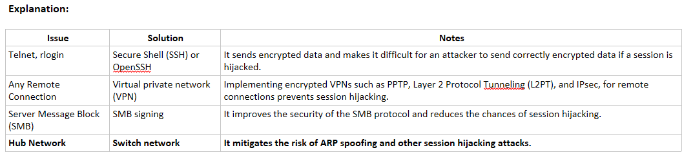

Which of the following attacks exploits the reuse of cryptographic nonce during the TLS handshake to hijack HTTPS sessions, leading to the disclosure of sensitive information?

CRIME attack
Session donation attack 
**Forbidden attack**
Proxy servers 

Explanation:
    • CRIME Attack: Compression Ratio Info-Leak Made Easy (CRIME) is a client-side attack that exploits the vulnerabilities present in the data compression feature of protocols, such as SSL/TLS, SPDY, and HTTPS. Attackers hijack the session by decrypting secret session cookies. The authentication information obtained from the session cookies is used to establish a new session with the web application
    • Proxy Servers: An attacker lures the victim to click on a bogus link, which looks legitimate but redirects the user to the attacker server. The attacker forwards the request to the legitimate server on behalf of the victim and serves as a proxy for the entire transaction. The attacker then captures the session’s information during the interaction of the legitimate server and user
    • Session Donation Attack: In a session donation attack, an attacker donates his/her own session identifier (SID) to the target user. The attacker first obtains a valid SID by logging into a service and later feeds the same SID to the target user. This SID links a target user back to the attacker’s account page without any information to the victim
    • Forbidden Attack: A forbidden attack is a type of man-in-the-middle attack used to hijack HTTPS sessions. It exploits the reuse of cryptographic nonce during the TLS handshake. After hijacking the HTTPS session, the attackers inject malicious code and forged content that prompts the victim to disclose sensitive information, such as bank account numbers, passwords, and social security numbers

Which of the following is the phase of a session fixation attack wherein an attacker waits for a victim to login to a target web server using a trap session ID and then enters the victim’s session?

Session set-up 
Brute forcing 
**Entrance**
Fixation 

Explanation:
A session fixation attack has the following three phases:
    • Session set-up phase: In this phase, the attacker first obtains a legitimate session ID by establishing a connection with the target web server. Few web servers support the idle session time-out feature. If the target web server supports this feature, the attacker needs to send requests repeatedly to keep the established trap session ID alive.
    • Fixation phase: In this phase, the attacker introduces the session ID to the victim's browser, thereby fixing the session.
    • Entrance phase: In this phase, the attacker waits for the victim to log in to the target web server using the trap session ID and then enters the victim’s session.
    • Brute forcing: In the brute-force technique, an attacker obtains session IDs by attempting all possible permutations of session ID values until finding one that works.

MitB (Man in the Browser) is a session hijacking technique heavily used by e-banking Trojans. The most popular ones are Zeus and Gameover Zeus. Explain how MitB attack works.

Malware is injected between the browser and network.dll, enabling to see the data before it is sent to the network and while it is being received from the network
Malware is injected between the browser and keyboard driver, enabling to see all the keystrokes
Man-in-the-Browser is just another name for sslstrip MitM attack
**Malware is injected between the browser and OS API, enabling to see the data before encryption (when data is sent from the machine) and after decryption (when data is being received by the machine)**

Explanation:
    • On Windows OS, malware is injected between the browser and wininet.dll, which allows it to see the data before encryption (wininet.dll is exposing APIs to use https etc.)

In which of the following types of hijacking can an attacker inject malicious data or commands into intercepted communications in a TCP session, even if the victim disables source routing?

**Blind hijacking**
RST hijacking
UDP hijacking
Session fixation 

Explanation:
    • RST Hijacking: RST hijacking involves injecting an authentic-looking reset (RST) packet by using a spoofed source IP address and predicting the acknowledgment number. The hacker can reset the victim’s connection if it uses an accurate acknowledgment number. The victim believes that the source has sent the reset packet and resets the connection.
    • Blind Hijacking: In blind hijacking, an attacker can inject malicious data or commands into intercepted communications in a TCP session, even if the victim disables source routing. For this purpose, the attacker must correctly guess the next ISN of a computer attempting to establish a connection. Although the attacker can send malicious data or a command, such as a password setting to allow access from another location on the network, the attacker cannot view the response.
    • UDP Hijacking: The User Datagram Protocol (UDP) does not use packet sequencing or synchronizing. Therefore, a UDP session can be attacked more easily than a TCP session. Because UDP is connectionless, it is easy to modify data without the victim noticing. In network level session hijack, the hijacker forges a server reply to a client UDP request before the server can respond
    • Session Fixation: The attacker performs a session fixation attack to hijack a valid user session. The attacker takes advantage of limitations in web-application session ID management. Web applications allow the user to authenticate themselves using an existing session ID, instead of generating a new session ID. In this type of attack, the attacker provides a legitimate web-application session ID and lures the victim to use it.

In order to hijack TCP traffic, an attacker has to understand the next sequence and the acknowledge number that the remote computer expects. Explain how the sequence and acknowledgment numbers are incremented during the 3-way handshake process.

Sequence number is not incremented and acknowledgment number is incremented by one during the 3-way handshake process
Sequence and acknowledgment numbers are incremented by two during the 3-way handshake process
Sequence number is incremented by one and acknowledge number is not incremented during the 3-way handshake process
**Sequence and acknowledgment numbers are incremented by one during the 3-way handshake process**

Explanation:
    • During the 3-way handshake, sequence and acknowledgment numbers are (relatively) incremented by one. After that acknowledge number will be incremented for the size of the packet received.
ut of the following, which network-level session hijacking technique is useful in gaining unauthorized access to a target computer with the help of a trusted host’s IP address?

**IP Spoofing: Source Routed Packets**
Bling Hijacking
UDP Hijacking
TCP/IP Hijacking

Explanation:
    • The source-routed packets technique is useful in gaining unauthorized access to a computer with the help of a trusted host’s IP address. This type of hijacking allows attackers to create their own acceptable packets to insert into the TCP session. First, the attacker spoofs the trusted host’s IP address so that the server managing a session with the host accepts the packets from the attacker. The packets are source-routed, so the sender specifies the path for packets from the source to the destination IP. Using this source-routing technique, attackers can fool the server into thinking that it is communicating with the user.

Given below are the various steps involved in PetitPotam hijacking attack.
    1. Now, the attacker initiates an NTLM replay attack to gain remote access to the target AD CS.
    2. The attacker uses the EfsRpcOpenFileRaw command from MS-EFSRPC API to coerce the target server to perform NTLM authentication of another system.
    3. The attacker uses the already captured NTLM credentials to authenticate with the target server.
    4. Finally, the attacker creates an AD certificate to gain administrator privileges to the target AD server.
Identify the correct sequence of steps involved in PetitPotam hijacking.

**3 -> 2 -> 1 -> 4**
1 -> 2 -> 3 -> 4 
2 -> 3 -> 1 -> 4 
3 -> 1 -> 2 -> 4 

Explanation:
Steps to perform PetitPotam hijacking:
    1. Attacker uses the already captured NTLM credentials to authenticate with the target server.
    2. The attacker uses the EfsRpcOpenFileRaw command from MS-EFSRPC API to coerce the target server to perform NTLM authentication of another system.
    3. Now, the attacker initiates NTLM replay attack to gain remote access to the target AD CS.
    4. Finally, the attacker creates an AD certificate to gain administrator privileges to the target AD server.

Robert, a professional hacker, was performing a session hijacking attack on a target organization. In this process, he installed a tool on an Android device and connected it to the organization’s network to obtain the session IDs of active users on the Wi-Fi network. He used those session IDs to access a website as an authorized user.
Which of the following tools did Robert employ in the above scenario?

Vega
PortQry 
ShellPhish
**DroidSheep**

Explanation:
    • Vega: Vega is a free and open-source web security scanner and web security testing platform for testing the security of web applications. Vega helps you to find and validate SQL injection, cross-site scripting (XSS), inadvertently disclosed sensitive information, and other vulnerabilities.
    • PortQry : The PortQry utility reports the port status of TCP and UDP ports on a selected target. Attackers can use the PortQry tool to perform TFTP enumeration. This utility reports the port status of target TCP and UDP ports on a local or remote computer.
    • DroidSheep: The DroidSheep tool is used for session hijacking on Android devices connected to a common wireless network. It obtains the session ID of active users on the Wi-Fi network and uses it to access a website as an authorized user. A DroidSheep user can easily observe the activities of authorized users on websites. It can also hijack social accounts by obtaining the session ID.
    • ShellPhish: ShellPhish is a phishing tool used to phish user credentials from various social networking platforms such as Instagram, Facebook, Twitter, and LinkedIn. It also displays the victim system’s public IP address, browser information, hostname, geolocation, and other information.

Which of the following is a portable framework written in Go that allows security researchers, red teamers, and reverse engineers to perform reconnaissance and various attacks on Wi-Fi networks?

Secure Everything 
Netcraft
**bettercap**
theHarvester

Explanation:
    • Secure Everything: Secure Everything uses AES encryption to secure SMS, videos, images, audio files, etc. This tool also helps in securing credit card details, bank account details, SSN, etc.
    • bettercap: bettercap is a portable framework written in Go that allows security researchers, red teamers, and reverse engineers to perform reconnaissance and various attacks on Wi-Fi networks, Bluetooth low energy devices, wireless HID devices, and IPv4/IPv6 networks.
    • Netcraft: Netcraft provides Internet security services, including anti-fraud and anti-phishing services, application testing, and PCI scanning.
    • theHarvester: theHarvester is a tool designed to be used in the early stages of a penetration test. It is used for open-source intelligence gathering and helps to determine a company's external threat landscape on the Internet. 

Which of the following techniques mitigates the risk of ARP spoofing and other session hijacking attacks caused when using a hub network?

SMB signing
**Switch network**
Virtual private network (VPN)
Secure Shell (SSH) or OpenSSH

Which of the following IPsec components is software that allows two computers to communicate by encrypting the data exchanged between them?

IPsec driver
IKE
Oakley
**ISAKMP**

Explanation:
Components of IPsec:
    • IPsec driver: Software that performs protocol-level functions required to encrypt and decrypt packets.
    • Internet Key Exchange (IKE): A protocol that produces security keys for IPsec and other protocols.
    • Internet Security Association and Key Management Protocol (ISAKMP): Software that allows two computers to communicate by encrypting the data exchanged between them.
    • Oakley: A protocol that uses the Diffie–Hellman algorithm to create a master key and a key that is specific to each session in IPsec data transfer.

Out of the following, which is not a component of the IPsec protocol?

**HPKP**
Oakley
IPsec policy agent
IKE

Explanation:
    • HTTP public key pinning (HPKP) is a trust on first use (TOFU) technique used in an HTTP header. HPKP is a security feature that tells a web client to associate a specific cryptographic public key with a certain webserver to decrease the risk of MITM attacks with forged certificates.

Which of the following components of an HTTP request contains the URL or URI of the web page, which can be used to navigate to the target web page along with the IP address and session ID?

MS-EFSRPC API call
HTTP public key pinning
Session ID
**HTTP referrer header**

Explanation:
    • HTTP Referrer Header: Fingerprinting the referrer header of each request will help in identifying the changes in the HTTP headers. When the attacker tries to hijack the session using a valid session ID, the HTTP header differs. Consequently, the intrusion gets detected and the session is terminated.
    • HTTP Public Key Pinning (HPKP): HTTP Public Key Pinning (HPKP) is a trust on first use (TOFU) technique used in an HTTP header that allows a web client to associate a specific public key certificate with a particular server to minimize the risk of MITM attacks based on fraudulent certificates.
    • MS-EFSRPC API call: The attacker uses Microsoft’s Encrypting File System Remote Protocol (MS-EFSRPC) API call for authentication session hijacking. The attacker’s SMB server manipulates the session to make the domain controller believe that the attacker is a legitimate user to receive the domain controller’s NTLM hash.
    • Session ID: A web server sends a session identification token or key to a web client after successful authentication.

