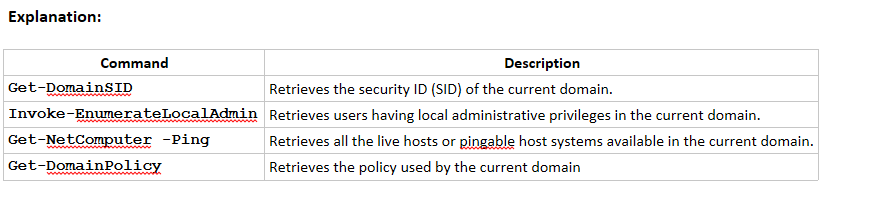
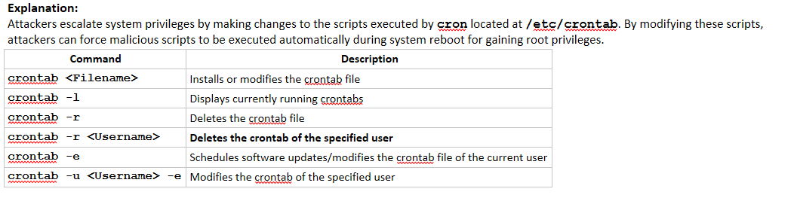
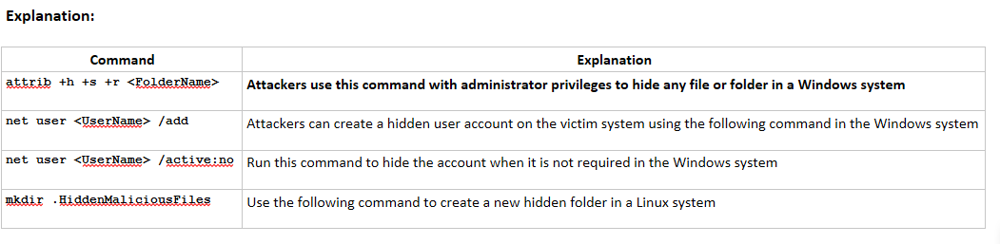
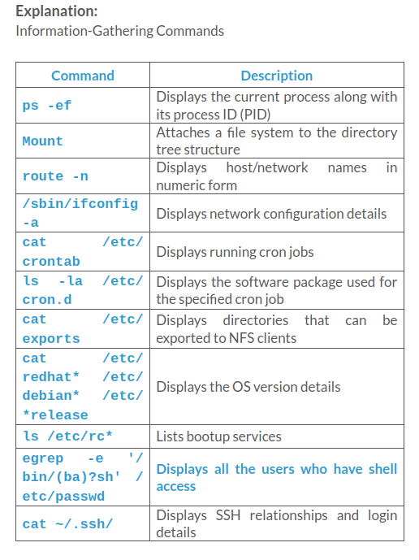

### Jake, a professional hacker, was hired to perform attacks on a target organization and disrupt its services. In this process, Jake decided to exploit a buffer overflow vulnerability and inject malicious code into the buffer to damage files. He started performing a stack-based buffer overflow to gain shell access to the target system. Which of the following types of registers in the stack-based buffer overflow stores the address of the next data element to be stored onto the stack?

- EBP
- EDI
- EIP
- **ESP**

Explanation:

>Stack memory includes five types of registers:
>- **EBP**: Extended Base Pointer (EBP), also known as StackBase, stores the address of the first data element stored onto the stack
>- **ESP**: Extended Stack Pointer (ESP) stores the address of the next data element to be stored onto the stack
>- **EIP**: Extended Instruction Pointer (EIP) stores the address of the next instruction to be executed 
>- **ESI**: Extended Source Index (ESI) maintains the source index for various string operations
>- **EDI**: Extended Destination Index (EDI) maintains the destination index for various string operations

### Which of the following attacks is similar to a brute-force attack but recovers passwords from hashes with a specific set of characters based on information known to the attacker?

- **Mask attack**
- Combinator attack
- Wire sniffing
- Fingerprint attack

Explanation:

>**Combinator Attack**: In a combinator attack, attackers combine the entries of the first dictionary with those of the second dictionary. The resultant list of entries can be used to produce full names and compound words. Attackers use this wordlist to crack a password on the target system and gain unauthorized access to the system files.

>**Mask Attack**: Mask attack is like brute-force attack but recovers passwords from hashes with a more specific set of characters based on information known to the attacker.

>**Fingerprint Attack**: In a fingerprint attack, the passphrase is broken down into fingerprints consisting of single- and multi-character combinations that a target user might choose as his/her password.

>**Wire Sniffing**: Packet sniffing is a form of wire sniffing or wiretapping in which hackers sniff credentials during transit by capturing Internet packets. Attackers rarely use sniffers to perform this type of attack. With packet sniffing, an attacker can gain passwords to applications such as email, websites, SMB, FTP, rlogin sessions, or SQL.

### Which of the following is a password cracking tool that allows attackers to reset the passwords of the Windows local administrator, domain administrator, and other user accounts?

- Audio Spyware
- **Secure Shell Bruteforcer**
- DeepSound
- OmniHide Pro

Explanation:

>**Secure Shell Bruteforcer**: It is a password cracking tool that allows you to reset unknown or lost Windows local administrator, domain administrator, and other user account passwords. In the case of forgotten passwords, it even allows users instant access to their locked computer without reinstalling Windows.

>**Audio Spyware**: Audio spyware is a sound surveillance program designed to record sound onto a computer. The attacker can silently install the spyware on the computer, without the permission of the computer user and without sending them any notification.
    
>**OmniHide Pro**: OmniHide PRO allows you to hide any secret file within an innocuous image, video, music file, etc.

>**DeepSound**: DeepSound allows you to hide any secret data in audio files (WAV and FLAC). It also allows you to extract secret files directly from audio CD tracks. In addition, it can encrypt secret files, thereby enhancing security.

### Identify the PowerView command that allows attackers to identify all the live hosts available within the current domain.

- **Get-NetComputer -Ping**
- Get-DomainSID
- Invoke-EnumerateLocalAdmin
- Get-DomainPolicy

### Which of the following misconfigured services allows attackers to deploy Windows OS without the intervention of an administrator?

- **Unattended installs**
- Modifiable registry autoruns
- Unquoted service paths
- Service object permissions

Explanation:

>**Service Object Permissions**: A misconfigured service permission may allow an attacker to modify or reconfigure the attributes associated with that service.

>**Unquoted Service Paths**: In Windows OSs, when a service starts running, the system attempts to find the location of the executable file to launch the service successfully. Generally, the executable path is enclosed in quotation marks “”, so that the system can easily locate the application binary.

>**Unattended Installs**: Unattended installs allow attackers to deploy Windows OSs without the intervention of an administrator. Administrators need to manually clean up the unattended install details stored in the Unattend.xml file.

>**Modifiable registry autoruns**: Attackers can exploit misconfigured autoruns in registries.

### Which of the following is a shim that runs in the user mode and is used by attackers to bypass UAC and perform different attacks including the disabling of Windows Defender and backdoor installation?

- WinRM
- launchd
- Schtasks
- **RedirectEXE**

Explanation:
    
>**RedirectEXE**: Shims like RedirectEXE, injectDLL, and GetProcAddress can be used by attackers to escalate privileges, install backdoors, disable Windows Defender, etc.

>**Schtasks**: The Windows OS includes utilities such as ‘at’ and ‘schtasks.’ A user with administrator privileges can use these utilities in conjunction with the Task Scheduler to schedule programs or scripts that can be executed at a particular date and time.

>**launchd**: During the MacOS and OS X booting process, launchd is executed to complete the system initialization process.

>**WinRM**: Attackers can use the winrm command to interact with WinRM and execute a payload on the remote system as a part of lateral movement.

### Richard, an attacker, is launching attacks on a target system to retrieve sensitive information from it. In this process, he used a privilege escalation technique to place an executable in a location such that the application will execute it instead of the legitimate executable. Which of the following techniques was employed by Richard to escalate privileges?

- Application shimming 
- Kernel exploits
- Web shell 
- **Path interception**

Explanation:

>**Path Interception**: Path interception is a method of placing an executable in a particular path in such a way that the application will execute it in place of the legitimate target. Attackers can exploit several flaws or misconfigurations to perform path interception like unquoted paths (service paths and shortcut paths), path environment variable misconfiguration, and search order hijacking.

>**Kernel Exploits**: Kernel exploits refer to programs that can exploit vulnerabilities present in the kernel to execute arbitrary commands or code with higher privileges. By successfully exploiting kernel vulnerabilities, attackers can attain superuser or root-level access to the target system.

>**Web Shell**: A web shell is a web-based script that allows access to a web server. Web shells can be created in all OSs like Windows, Linux, MacOS, and OS X. Attackers create web shells to inject a malicious script on a web server to maintain persistent access and escalate privileges. 

>**Application Shimming**: Shims run in user mode, and they cannot modify the kernel. Some of these shims can be used to bypass UAC (RedirectEXE), inject malicious DLLs (InjectDLL), capture memory addresses (GetProcAddress), etc. An attacker can use these shims to perform different attacks including disabling Windows Defender, privilege escalation, installing backdoors, etc. 

### A pen tester is using Metasploit to exploit an FTP server and pivot to a LAN. How will the pen tester pivot using Metasploit?

- Set the payload to propagate through the meterpreter.
- Reconfigure the network settings in the meterpreter.
- Issue the pivot exploit and set the meterpreter.
- **Create a route statement in the meterpreter.**

Explanation:

>When malicious activities are performed on the system with Metasploit Framework, the Logs of the target system can be wiped out by launching meterpreter shell prompt of the Metasploit Framework and typing clearev command in meterpreter shell prompt followed by typing Enter.

### Which of the following operating systems allows loading of weak dylibs dynamically that is exploited by attackers to place a malicious dylib in the specified location?

- Unix
- Linux
- Android
- **macOS**

Explanation:

>**macOS** provides several legitimate methods, such as setting the DYLD_INSERT_LIBRARIES environment variable, which are user specific. These methods force the loader to automatically load malicious libraries into a target running process. macOS allows the loading of weak dylibs (dynamic libraries) dynamically, which in turn allows an attacker to place a malicious dylib in the specified location.

### Which of the following commands allows attackers to delete the crontab of the specified user in a Linux system?

- crontab -u <Username> -e 
- crontab -l
- **crontab -r <Username>**
- crontab <Filename>

### Which of the following rootkit detection techniques compares the characteristics of all system processes and executable files with a database of known rootkit fingerprints?

- **Signature-based detection**
- Alternative trusted medium
- Integrity-based detection
- Heuristic/behavior-based detection

Explanation:

>**Integrity-Based Detection**: It compares a snapshot of the file system, boot records, or memory with a known trusted baseline.

>**Heuristic/Behavior**- Based Detection: Any deviations in the system’s normal activity or behavior may indicate the presence of a rootkit.

>**Signature-Based Detection**: This technique compares characteristics of all system processes and executable files with a database of known rootkit fingerprints.

>**Alternative Trusted Medium**: The infected system is shut down and then booted from an alternative trusted media such as a bootable CD-ROM or USB flash drive to find the traces of the rootkit.

### Identify the technique used by the attackers to execute malicious code remotely?

- Sniffing network traffic
- Rootkits and steganography
- Modify or delete logs
- **Install malicious programs**

Explanation:

>**Executing Applications**: Once attackers have administrator privileges, they attempt to install malicious programs such as Trojans, Backdoors, Rootkits, and Keyloggers, which grant them remote system access, thereby enabling them to execute malicious codes remotely. Installing Rootkits allows them to gain access at the operating system level to perform malicious activities. To maintain access for use at a later date, they may install Backdoors.

>**Hiding Files**: Attackers use Rootkits and steganography techniques to attempt to hide the malicious files they install on the system, and thus their activities.

>**Covering Tracks**: To remain undetected, it is important for attackers to erase all evidence of security compromise from the system. To achieve this, they might modify or delete logs in the system using certain log-wiping utilities, thus removing all evidence of their presence.

>**Gaining Access**: In system hacking, the attacker first tries to gain access to a target system using information obtained and loopholes found in the system’s access control mechanism. Once attackers succeed in gaining access to the system, they are free to perform malicious activities such as stealing sensitive data, implementing a sniffer to capture network traffic, and infecting the system with malware. At this stage, attackers use techniques such as password cracking and social engineering tactics to gain access to the target system.

### Which of the following are valid types of rootkits? (Choose three.)

- Physical level
- **Application level**
- **Kernel level**
- Network level
- Data access level
- **Hypervisor level**

Explanation:

>**Hypervisor-level rootkit**: Attackers create hypervisor-level rootkits by exploiting hardware features such as Intel VT and AMD-V. These rootkits run in Ring-1, host the operating system of the target machine as a virtual machine, and intercept all hardware calls made by the target operating system. This kind of rootkit works by modifying the system’s boot sequence and gets loaded instead of the original virtual machine monitor.

>**Kernel-level rootkit**: The kernel is the core of the operating system. Kernel-level rootkit runs in Ring-0 with highest operating system privileges. These cover backdoors on the computer and are created by writing additional code or by substituting portions of kernel code with modified code via device drivers in Windows or loadable kernel modules in Linux. If the kit’s code contains mistakes or bugs, kernel-level rootkits affect the stability of the system. These have the same privileges of the operating system; hence, they are difficult to detect and intercept or subvert the operations of operating systems.

>**Application-level rootkit**: Application-level rootkit operates inside the victim’s computer by replacing the standard application files (application binaries) with rootkits or by modifying behavior of present applications with patches, injected malicious code, and so on.

### Which type of rootkit is created by attackers by exploiting hardware features such as Intel VT and AMD-V?

- **Hypervisor level rootkit**
- Hardware/firmware rootkit
- Kernel level rootkit
- Boot loader level rootkit

Explanation:

>**Hypervisor Level Rootkit**: Attackers create Hypervisor level rootkits by exploiting hardware features such as Intel VT and AMD-V. These rootkits runs in Ring-1 and host the operating system of the target machine as a virtual machine and intercept all hardware calls made by the target operating system. This kind of rootkit works by modifying the system’s boot sequence and gets loaded instead of the original virtual machine monitor.

>**Hardware/Firmware Rootkit**: Hardware/firmware rootkits use devices or platform firmware to create a persistent malware image in hardware, such as a hard drive, system BIOS, or network card. The rootkit hides in firmware as the users do not inspect it for code integrity. A firmware rootkit implies the use of creating a permanent delusion of rootkit malware.

>**Kernel Level Rootkit**: The kernel is the core of the operating system. Kernel level rootkit runs in Ring-0 with highest operating system privileges. These cover backdoors on the computer and are created by writing additional code or by substituting portions of kernel code with modified code via device drivers in Windows or loadable kernel modules in Linux. 

### In which of the following techniques is the text or an image considerably condensed in size, up to one page in a single dot, to avoid detection by unintended recipients?

- **Microdots**
- Spread spectrum
- Invisible ink
- Computer-based methods

Explanation:

>**Microdots**: A microdot is text or an image considerably condensed in size (with the help of a reverse microscope), up to one page in a single dot, to avoid detection by unintended recipients. Microdots are usually circular, about one millimeter in diameter, but are changeable into different shapes and sizes.

>**Computer-based methods**: A computer-based method makes changes to digital carriers to embed information foreign to the native carriers. Communication of such information occurs in the form of text, binary files, disk and storage devices, and network traffic and protocols, and can alter the software, speech, pictures, videos or any other digitally represented code for transmission.

>**Invisible ink**: Invisible ink, or “security ink,” is one of the methods of technical steganography. It is used for invisible writing with colorless liquids and can later be made visible by certain pre-negotiated manipulations such as lighting or heating. For example, if you use onion juice and milk to write a message, the writing will be invisible, but when heat is applied, it turns brown and the message becomes visible.

>**Spread spectrum**: This technique is less susceptible to interception and jamming. In this technique, communication signals occupy more bandwidth than required to send the information. The sender increases the band spread by means of code (independent of data), and the receiver uses a synchronized reception with the code to recover the information from the spread spectrum data.

### In a Windows system, an attacker was found to have run the following command: type C:\SecretFile.txt >C:\LegitFile.txt:SecretFile.txt. What does the above command indicate?

- **Attacker has used Alternate Data Streams to hide SecretFile.txt file into LegitFile.txt**
- Attacker was trying to view SecretFile.txt file hidden using an Alternate Data Stream
- Attacker has used Alternate Data Streams to rename SecretFile.txt file to LegitFile.txt
- Attacker has used Alternate Data Streams to copy the content of SecretFile.txt file into LegitFile.txt

Explanation:

>- NTFS has a feature called as Alternate Data Streams that allows attackers to hide a file behind other normal files. Given below are some steps in order to hide file using NTFS:
>- Open the command prompt with an elevated privilege
>- Type the command “type C:\SecretFile.txt >C:\LegitFile.txt:SecretFile.txt” 
>- (here, file is kept in C drive where SecretFile.txt file is hidden inside LegitFile.txt file)
>- To view the hidden file, type “more < C:\SecretFile.txt” (for this you need to know the hidden file name)

### A technique allows attackers to conduct persistence attacks if they identify a service with all the necessary permissions that is connected with a registry key, and when any authorized user attempts to log in, the service link associated with the registry runs automatically. Identify this technique.

- Abusing Data Protection API (DPAPI)
- Abusing accessibility features
- Abusing AdminSDHolder
- **Abusing boot or logon autostart executions**

Explanation:
  
>**Abusing Data Protection API (DPAPI)**: DPAPI is a unified location in Windows environments where all the cryptographically secured files, passwords of browsers, and other critical data are stored. Windows domain controllers (DCs) contain a master key to decrypt DPAPI-protected files. Attackers often attempt to obtain this master key from the DC.

>**Abusing AdminSDHolder**: AdminSDHolder is an object of AD that protects user accounts and groups having high privileges against accidental modifications of security permissions.

>**Abusing Boot or Logon Autostart Executions**: Attackers can conduct persistence attacks or privilege escalation if they identify a service with all the necessary permissions that is connected with the registry key. When any authorized user attempts to log in, the service link associated with the registry runs automatically.

>**Abusing accessibility features**: Attackers create persistence and escalate privileges by embedding and running malicious code within Windows accessibility features.

### Which of the following countermeasures allows a security professional to defend against techniques for covering tracks?

- Leave all unused open ports and services as they are
- Periodically back up log files to alterable media
- **Activate the logging functionality on all critical systems**
- Ensure that new events overwrite old entries in log files

Explanation:

>Some of the best practices to defend against covering tracks include:
>- Activate logging functionality on all critical systems
>- Conduct a periodic audit on IT systems to ensure logging functionality is in accordance with the security policy
>- Ensure new events do not overwrite old entries in the log files when the storage limit is exceeded
>- Configure appropriate and minimal permissions necessary to read and write log files stored on critical systems
>- Maintain a separate logging server on the DMZ so that all the critical servers, such as the DNS server, mail server, web server, etc., forward and store their logs on that server
>- Regularly update and patch OSs, applications, and firmware 
>- Close all unused open ports and services
>- Encrypt the log files stored on the system, so that altering them is not possible without an appropriate decryption key
>- Set log files to “append only” mode to prevent unauthorized deletion of log entries
>- Periodically back up the log files to unalterable media

### Which of the following techniques is used by the attackers to clear online tracks?

- Disable the user account
- Disable LMNR and NBT-NS services
- **Disable auditing**
- Disable LAN manager

Explanation:
>- Techniques used for Clearing Tracks
>- The main activities that an attacker performs toward removing his/her traces on the computer are:
>- Disable auditing: An attacker disables auditing features of the target system
>- Clearing logs: An attacker clears/deletes the system log entries corresponding to his/her activities
>- Manipulating logs: An attacker manipulates logs in such a way that he/she will not be caught in legal actions

### Which of the following is a sh-compatible shell that stores command history in a file?

- ksh
- Zsh
- Tcsh/Csh
- **BASH**

Explanation:

>**BASH**: The BASH or Bourne Again Shell is a sh-compatible shell which stores command history in a file called bash history. You can view the saved command history using more ~/.bash_history command. This feature of BASH is a problem for hackers as the bash_history file could be used by investigators in order to track the origin of an attack and the exact commands used by an intruder in order to compromise a system.

>**Tcsh**: This is a Unix shell and compatible with C chell. It comes with features such as command-line completion and editing, etc. Users cannot define functions using tcsh script. They need to use scripts such as Csh to write functions.

>**Zsh**: This shell can be used as an interactive login shell as well as a command-line interpreter for writing shell scripts. It is an extension of Bourne shell and includes vast number of improvements.

>**Ksh**: It improved version of the Bourne shell that includes floating-point arithmetic, job control, command aliasing and command completion.

### Which of the following is used by an attacker to manipulate the log files?

- clearlogs.exe
- Clear_Event_Viewer_Logs.bat
- **ECEVENT.EVT**
- Auditpol.exe

Explanation:

>**Auditpol.exe**: Auditpol.exe is the command line utility tool to change Audit Security settings at the category and sub-category levels. Attackers can use AuditPol to enable or disable security auditing on local or remote systems and to adjust the audit criteria for different categories of security events.

>**Clear_Event_Viewer_Logs.bat/clearlogs.exe**: The Clear_Event_Viewer_Logs.bat or clearlogs.exe is a utility that can be used to wipe out the logs of the target system. This utility can be run through command prompt, PowerShell, and using a BAT file to delete security, system, and application logs on the target system. Attackers might use this utility, wiping out the logs as one method of covering their tracks on the target system.

>**SECEVENT.EVT**: Attackers may not wish to delete an entire log to cover their tracks, as doing so may require admin privileges. If attackers are able to delete only attack event logs, they will still be able to escape detection.

>The attacker can manipulate the log files with the help of: SECEVENT.EVT (security): failed logins, accessing files without privileges
>- **SYSEVENT.EVT** (system): Driver failure, things not operating correctly
>- **APPEVENT.EVT** (applications)

### Which of the following commands allows an attacker having administrator privileges to hide any file or folder in a Windows system?

- mkdir .HiddenMaliciousFiles
- **attrib +h +s +r <FolderName>**
- net user <UserName> /add
- net user <UserName> /active:no

### Given below are the different steps followed in pivoting.

1. Exploit vulnerable services.
2. Discover live hosts in the network.
3. Scan ports of live systems.
4. Set up routing rules.

### What is the correct sequence of steps involved in pivoting?

- 2 -> 1 -> 3 -> 4
- 2 -> 3 -> 1 -> 4
- **2 -> 4 -> 3 -> 1**
- 1 -> 2 -> 3 -> 4

Explanation:

>The sequence of steps to perform pivoting:
>- Discover live hosts in the network
>- Set up routing rules
>- Scan ports of live systems
>- Exploit vulnerable services

### Which of the following vulnerabilities allows attackers to trick a processor to exploit speculative execution to read restricted data?

- DLL hijacking
- **Spectre**
- Meltdown
- Dylib hijacking

Explanation:

>**Meltdown vulnerability**: This is found in all the Intel processors and ARM processors deployed by Apple. This vulnerability leads to tricking a process to access out-of-bounds memory by exploiting CPU optimization mechanisms such as speculative execution.
>**Dylib hijacking**: This allows an attacker to inject a malicious dylib in one of the primary directories and simply load the malicious dylib at runtime.
>**Spectre vulnerability**: Spectre vulnerability is found in many modern processors such as AMD, ARM, Intel, Samsung, and Qualcomm processors. This vulnerability leads to tricking a processor to exploit speculative execution to read restricted data. The modern processors implement speculative execution to predict the future and to complete the execution faster.
>**DLL hijacking**: In DLL hijacking attackers place a malicious DLL in the application directory; the application will execute the malicious DLL in place of the real DLL.

### Which of the following types of rootkits replaces original system calls with fake ones to hide information about the attacker?

- Hypervisor-level rootkit
- Boot-loader-level rootkit
- **Library-level rootkit**
- Hardware/firmware rootkit

Explanation:

>**Boot Loader Level Rootkit**: Replaces the original boot loader with the one controlled by a remote attacker.
>**Hardware/Firmware Rootkit**: Hides in hardware devices or platform firmware that are not inspected for code integrity.
>**Hypervisor Level Rootkit**: Acts as a hypervisor and modifies the boot sequence of the computer system to load the host operating system as a virtual machine.
>**Library Level Rootkit**: Replaces the original system calls with fake ones to hide information about the attacker.

### Which of the following is malicious code concealed within UEFI firmware in SPI flash, scheduled to be executed at a specific time?

- GlitchPOS
- Restorator
- Dreambot
- **MoonBounce**

Explanation:

>**Dreambot**: Dreambot banking Trojans are also known as updated versions of Ursnif or Gozi. Dreambot Trojans have long been used by hackers, and they have been regularly updated with more sophisticated capabilities. They can be delivered through the Emotet dropper or RIG exploit kit. This Trojan can also be embedded as a macro in an MS word document and sent to victims via spam emails. If this Trojan gets into the victim’s machine, it will covertly create registry keys and processes, and attempt to connect to multiple malicious C2C servers.

>**MoonBounce**: MoonBounce is malicious code concealed within UEFI firmware in the SPI flash that is scheduled to be executed at a specific time. Security systems have limited awareness of such implants; therefore, they are difficult to detect and remove. MoonBounce has a complex attack flow that is noticeably better than previously known UEFI firmware bootkits.

>**GlitchPOS**: It is popularly known as GlitchPOS.A. GlitchPOS is a fake cat game that is embedded in malware and not displayed at the time of execution. It is a Trojan that masquerades as a cat game.

>**Restorator**: Restorator is a utility for editing Windows resources in applications and their components (e.g., files with .exe, .dll, .res, .rc, and .dcr extensions). It allows you to change, add, or remove resources such as text, images, icons, sounds, videos, versions, dialogs, and menus in nearly all programs. Using this tool, one can achieve translation/localization, customization, design improvement, and development.

### Which of the following commands allows attacks to abuse Data Protection API (DPAPI) to obtain all the backup master keys from Windows domain controllers (DCs)?

- lsadump::dcsync /domain:domain name /user:krbtgt
- Invoke-Mimikatz -command '"lsadump::dcsync /domain:<Target Domain> /user:<krbtgt>\<Any Domain User>"
- mimikatz “lsadump::dcsync /domain:(domain name) /user:Administrator”
- lsadump::backupkeys /system:dc01.offense.local /export

Explanation:

>`lsadump::backupkeys /system:dc01.offense.local /export`: Attackers run this command to retrieve all backup master keys.

>`lsadump::dcsync /domain:domain name /user:krbtgt`: Attackers use mimikatz to perform a pass-the-hash attack or DCSync attack to steal KRBTGT’s password hash by executing this command.
    
>`Invoke-Mimikatz -command '"lsadump::dcsync /domain:<Target Domain> /user:<krbtgt>\<Any Domain User>"`: Attackers attempt malicious replication using this command.

>`mimikatz “lsadump::dcsync /domain:(domain name) /user:Administrator”`: Attackers execute this command to retrieve the NTLM password hashes of an administrator account.

### George, a professional hacker, compromised the target domain controller to maintain domain dominance. For this reason, he installed a memory-resident virus that injects false credentials into a DC to create a backdoor password. Using the virus, George obtained the master password to validate himself as a legitimate user in the domain. Which of the following attacks did George perform in the above scenario?

- Overpass-the-hash attack
- **Skeleton key attack**
- Dumpster diving
- STP attack

Explanation:

> **Overpass-the-Hash Attack**: The overpass-the-hash (OPtH) attack is an extension of pass-the-ticket and pass-the-hash attacks. It is a type of credential theft-and-reuse attack using which attackers perform malicious activities on compromised devices or environments.

> **Dumpster Diving**: “Dumpster diving” is a key attack method that employs significant failures in computer security in the target system.

> **STP Attack**: In a Spanning Tree Protocol (STP) attack, attackers connect a rogue switch into the network to change the operation of the STP protocol and sniff all the network traffic. STP is used in LAN-switched networks with the primary function of removing potential loops within the network.

> **Skeleton Key Attack**: A skeleton key is a form of malware that attackers use to inject false credentials into domain controllers (DCs) to create a backdoor password. It is a memory-resident virus that enables an attacker to obtain a master password to validate themselves as a legitimate user in the domain.

### Which of the following commands allows an attacker to retrieve all the users who have shell access?

- /sbin/ifconfig -a
- cat /etc/redhat* /etc/debian* /etc/*release
- ls -la /etc/cron.d
- **egrep -e '/bin/(ba)?sh' /etc/passwd**

